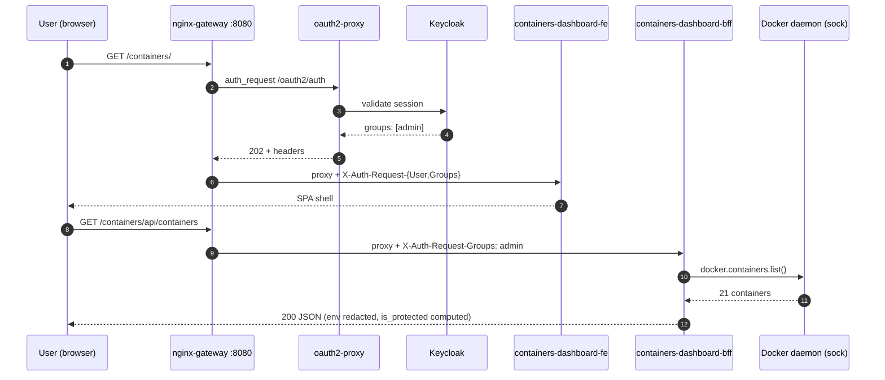
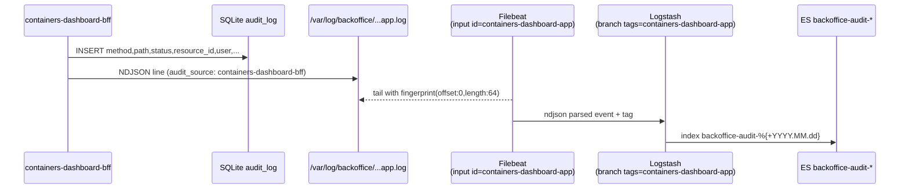

# Containers Dashboard — User Guide

> BackOffice microfrontend for managing the host's Docker daemon.
> BackOffice sub-stack. Coexists with Portainer. Audit unified in ELK.

**MVP version** · Container, image, volume, network: list / detail / start-stop-restart / exec / remove. SSE for live logs and stats. WS for exec shell.

---

## Index

- [Part 1 — User manual](#part-1--user-manual)
  - [1.1 What is it?](#11-what-is-it)
  - [1.2 Roles and permissions](#12-roles-and-permissions)
  - [1.3 First access](#13-first-access)
  - [1.4 List containers / images / volumes / networks](#14-list-containers--images--volumes--networks)
  - [1.5 Container detail](#15-container-detail)
  - [1.6 Live logs and stats](#16-live-logs-and-stats)
  - [1.7 Start / Stop / Restart](#17-start--stop--restart)
  - [1.8 Exec shell](#18-exec-shell)
  - [1.9 Remove](#19-remove)
  - [1.10 Common errors](#110-common-errors)
  - [1.11 Containers Dashboard or Portainer?](#111-containers-dashboard-or-portainer)
- [Part 2 — Stack operator manual](#part-2--stack-operator-manual)
  - [2.1 Sub-stack architecture](#21-sub-stack-architecture)
  - [2.2 Startup and shutdown](#22-startup-and-shutdown)
  - [2.3 Security model](#23-security-model)
  - [2.4 Audit pipeline (SQLite + ELK)](#24-audit-pipeline-sqlite--elk)
  - [2.5 Configuration files](#25-configuration-files)
  - [2.6 Operational runbooks](#26-operational-runbooks)
  - [2.7 Known limitations](#27-known-limitations)
  - [2.8 References](#28-references)

---

# Part 1 — User manual

## 1.1 What is it?

Containers Dashboard exposes, over corporate HTTP `/containers/`, a SPA that lets you:

- **List** all host containers (running or stopped), images, volumes, and networks.
- **Inspect** a container: overview, logs (live SSE), CPU/MEM stats (live SSE), inspect JSON.
- **Operate**: start / stop / restart (admin + operator).
- **Diagnose**: open an exec shell inside the container (admin).
- **Remove**: container / image / volume / network with type-the-name confirmation (admin).

Every action is **audited** to `backoffice-audit-*` (Elasticsearch) and to local SQLite.



## 1.2 Roles and permissions

Inherited from BackOffice — **same Keycloak group `lglabs.*`**:

| Role | Listings | Detail / Logs / Stats / Inspect | Start/Stop/Restart | Exec shell | Remove |
|---|---|---|---|---|---|
| `admin`    | ✅ | ✅ | ✅ | ✅ | ✅ |
| `operator` | ✅ | ✅ | ✅ | — (button hidden) | — (button hidden) |
| `support`  | ✅ | ✅ | — | — | — |
| `viewer`   | ✅ | ✅ | — | — | — |

Defense-in-depth: **gateway** (nginx) filters by `X-Auth-Request-Groups` header before proxying; **BFF** re-checks via `require_admin` / `require_writer` / `require_reader`. Gateway-blocked → HTML "Access denied"; BFF-blocked → JSON `forbidden`.

## 1.3 First access

1. `make backoffice-up` (includes containers-dashboard).
2. Open `http://localhost:8080/containers/`.
3. Login with `lglabsadmin` / `lgpass` (or any of the 4 seed users).
4. You will see the **Projects** view (landing) with cards — one per Compose project detected on the host. For the classic daemon summary, navigate to `Home` from the menu.

## 1.4 Projects view (landing) [Phase I]

The main page `/containers/` shows **Projects** — an automatic grouping by `com.docker.compose.project` (label Compose adds to every container it creates).

**Project cards** show:
- Project name.
- Aggregate state: 🟢 `up` (all running) · 🟡 `degraded` (some stopped) · 🔴 `down` (errored) · ⚪ `stopped`.
- `m / n running` containers.
- Counts of services / networks / volumes.

**Toggle "Include unmanaged"**: shows the pseudo-project `(unmanaged)` with containers launched via `docker run` (no compose label). Hidden by default.

### Project detail

Click a card → `/containers/#/projects/<name>` with 4 tabs:

1. **Overview** — Services table with name · container · state · image · ports. Click container name → container detail page (where start/stop/restart/remove actions live).
2. **Topology** — **Component diagram** rendered with Mermaid. Services as nodes colored by state:
   - 🟩 green = running · 🟥 red = exited/dead · 🟨 amber = paused/restarting · ⬜ grey = others.
   - Edges (3 types, each with distinct style):
     - **`-->` solid line** = `depends_on` declared in compose (start order).
     - **`-.-> network` dashed** = both services share that network (can talk).
     - **`==> volume` thick line** = both services mount that volume.
   - 3 checkboxes in the header allow hide/show each edge type without re-fetch.
   - **Click a node** → opens the container detail page.
   - If the project has > 20 services, the graph is disabled by default (warning + "Render anyway" button) to prevent lag.
3. **Networks** — Accordion list of project networks and the services attached to each.
4. **Volumes** — Accordion list of project volumes and the services that mount each.

### Visual example

```mermaid
graph LR
  gateway["gateway\nlg-infra-backoffice-gateway"]:::cdRunning
  keycloak["keycloak\nlg-infra-backoffice-keycloak"]:::cdRunning
  proxy["oauth2-proxy\nlg-infra-backoffice-proxy"]:::cdRunning
  cdbff["containers-dashboard-bff\nlg-infra-backoffice-containers-dashboard-bff"]:::cdRunning
  cdfe["containers-dashboard-fe\nlg-infra-backoffice-containers-dashboard-fe"]:::cdRunning
  gateway -.-|lg-backoffice| keycloak
  gateway -.-|lg-backoffice| proxy
  gateway -.-|lg-backoffice| cdbff
  cdbff -.-|lg-backoffice| cdfe
  cdbff ==|backoffice-audit-logs| proxy
  classDef cdRunning fill:#bbf7d0,stroke:#16a34a;
```

> _Conceptual capture of the `lg-infra-backoffice` project with 3 networks (only one rendered in the example) and one shared volume `backoffice-audit-logs`._

## 1.5 List containers / images / volumes / networks (flat view)

- **Containers** (`#/containers`): table state · name · image · compose project · ports. Filters: text search, "hide stopped". Click row → detail.
- **Images** (`#/images`): repository · tag · id_short · size · count of using containers.
- **Volumes** (`#/volumes`): name · driver · mountpoint · count of mounting containers.
- **Networks** (`#/networks`): name (with 🔒 icon if builtin) · driver · scope · internal · attached containers · id_short.

Per-row icons (admin only):
- 🗑 Remove button (disabled with tooltip if protected / in-use / builtin).

## 1.5 Container detail

URL: `#/containers/<id_or_name>` with 4 tabs:

- **Overview** — id · image · status · compose project/service · restart policy · health · networks (IP/MAC) · mounts (type · source · target · mode).
- **Logs** — last N lines (default 500). "▶ Stream" button opens SSE for live tail. "⏸ Stop" closes the stream.
- **Stats** — per-second SSE: CPU% · MEM% · MEM usage/limit · NET RX/TX · Block I/O.
- **Inspect** — raw (formatted) JSON, env redacted.

Action buttons (top-right) only visible to allowed roles:
- ▶ **Start**, ■ **Stop**, ↻ **Restart** (writer = admin|operator).
- ⌘ **Exec** (admin), 🗑 **Remove** (admin).

Container protected by denylist → all action buttons disabled with tooltip "🔒 protected".

## 1.6 Live logs and stats

- Logs: GET `/containers/<id>/logs?tail=N` for snapshot; SSE `/containers/<id>/logs/stream?tail=200` for live tail. The SPA combines both.
- Stats: SSE `/containers/<id>/stats`, per-second emission. If the container stops, the stream closes silently.

Under the hood SSE in nginx-gateway: `proxy_buffering off`, `proxy_read_timeout 3600s`.

## 1.7 Start / Stop / Restart

- **Start**: 1 click. No confirmation modal. Already running → 409 `already_running`.
- **Stop**: modal with typed-name + `timeout_seconds` slider (1–60). Without confirmation → 409 `confirmation_required`.
- **Restart**: same as Stop.

After the action, the SPA polls state 5 times (1s each) and refreshes the card.

## 1.8 Exec shell

Admin only. Access from ⌘ Exec button in detail (only if container `running` and not protected). URL: `#/containers/<id>/exec`.

UX:
- Shell selector: `sh` or `bash` (default `sh`). Other values → WS close `1008 invalid_shell`.
- Connect button → opens WebSocket.
- xterm.js with `FitAddon` (auto resize).
- Amber awareness banner: "Shell content is **NOT persisted**, only `exec_open` / `exec_close` with metadata (status, duration, exit_code, close_reason)".
- 5min idle → auto disconnect (close_reason: `idle_timeout`).
- Exit with `Ctrl+D` or Disconnect button.

## 1.9 Remove

Admin only. Confirmation modal:

1. Type-the-name: must type the exact name in the input.
2. Header `X-Confirm-Resource: <name>` sent by the SPA → 409 if missing/mismatch.
3. Optional checkboxes by type:
   - **Container**: `force` (kill if running) + `remove_volumes` (anonymous volumes).
   - **Image**: `force` (remove even if used by other containers).
   - **Volume / Network**: no checkboxes — server rejects with 409 `volume_in_use` / `network_in_use` if in use. Manual cleanup required.

Specific errors:
- 423 `protected_resource` — denylisted container (cannot remove).
- 403 `builtin_network_protected` — bridge / host / none.
- 409 `container_running` — without force.
- 409 `image_in_use` — `details.used_by` lists referencing containers.
- 409 `volume_in_use` — mounted by some container.
- 409 `network_in_use` — `details.attached` lists connected containers.

## 1.10 Common errors

| UI error | Cause | Solution |
|---|---|---|
| 401 / login redirect | session expired or unauthenticated | re-login; tokens TTL 5min in lab |
| 403 HTML "Access denied" | gateway: your role isn't allowed | check role; ask admin |
| 403 JSON `forbidden` | BFF rejected despite gateway | bug → report |
| 409 `confirmation_required` | missing X-Confirm-Resource | SPA sends it; if seen it's a browser bug |
| 423 `protected_resource` | action on denylisted container | use `docker` CLI directly if truly needed |
| 1008 `invalid_shell` (WS) | shell other than sh/bash | use sh or bash |
| 1008 `protected_resource` (WS) | exec on denylisted container | impossible by design |
| EventSource `onerror` | container stopped during stream | normal; closes the SSE |

## 1.11 Containers Dashboard or Portainer?

| Use case | Use |
|---|---|
| Team operation with centralized ELK audit + SSO RBAC | **Containers Dashboard** |
| Self-protection (don't break BackOffice by accident) | **Containers Dashboard** |
| Stacks editor / multi-host / swarm / build pipelines / registry UI | **Portainer** |
| Advanced 360° Docker view | **Portainer** |

Both coexist in the same BackOffice (`/containers/` and `/portainer/`).

---

# Part 2 — Stack operator manual

## 2.1 Sub-stack architecture

```mermaid
flowchart LR
  subgraph backoffice
    GW[nginx-gateway :8080]
    PRX[oauth2-proxy]
    KC[Keycloak]
    HOME[home FE]
    PORT[Portainer]
    KFE[kafka-dashboard FE]
    KBFF[kafka-dashboard BFF]
    CFE[containers-dashboard FE<br/>nginx + Alpine + xterm.js]
    CBFF[containers-dashboard BFF<br/>FastAPI + docker-py]
  end
  subgraph elk
    FB[Filebeat]
    LS[Logstash]
    ES[(Elasticsearch<br/>backoffice-audit-*)]
    KB[Kibana]
  end
  SOCK[/var/run/docker.sock]
  VAUDIT[(vol backoffice-audit-logs)]
  VDATA[(vol backoffice-containers-dashboard-data<br/>SQLite audit_log)]

  GW --> PRX --> KC
  GW --> HOME
  GW --> PORT
  GW --> KFE & KBFF
  GW -- /containers/ --> CFE
  GW -- /containers/api/ + WS exec --> CBFF
  CBFF -- "rw" --> SOCK
  CBFF --> VDATA
  CBFF -- NDJSON --> VAUDIT
  PRX -- access logs --> VAUDIT
  KBFF -- NDJSON --> VAUDIT
  VAUDIT --> FB --> LS --> ES --> KB
```

| Component | Image | Internal port | Volumes |
|---|---|---|---|
| `containers-dashboard-fe` | nginx:1.27-alpine + bind-mount `frontend/` | 80 | — |
| `containers-dashboard-bff` | python:3.12-slim + `bff/` build | 8000 | `backoffice-containers-dashboard-data` (SQLite), `backoffice-audit-logs` (audit NDJSON), `/var/run/docker.sock:rw` |

Container names: `lg-infra-backoffice-containers-dashboard-{fe,bff}`. Network: `lg-backoffice` (shared with rest of BackOffice).

## 2.2 Startup and shutdown

```bash
# Prerequisites
make elk-up

# Bring up BackOffice (includes containers-dashboard via include:)
make backoffice-up

# Stop (preserves volumes)
make backoffice-down

# Destroy (includes `backoffice-containers-dashboard-data`)
make backoffice-clean
```

Restart sub-stack only:
```bash
docker compose -f backoffice/docker-compose.yml restart \
  containers-dashboard-bff containers-dashboard-fe
```

Frontend is bind-mount → changes in `frontend/` reflect instantly (no rebuild). BFF requires `docker compose build containers-dashboard-bff && up -d` for Python code changes.

## 2.3 Security model

**Privilege**: BFF has `docker.sock:rw` (same privilege level as the daemon). Mitigations:

1. **Denylist** (`bff/app/safety/denylist.py`). Hard-coded — NO env, NO YAML, NO runtime override:
   - `lg-infra-backoffice-keycloak`
   - `lg-infra-backoffice-gateway`
   - `lg-infra-backoffice-proxy` (oauth2-proxy)
   - `lg-infra-backoffice-portainer`
   - `lg-infra-backoffice-containers-dashboard-bff`
   - `lg-infra-backoffice-containers-dashboard-fe`

   Any stop/restart/exec/remove against one of these → HTTP 423 `protected_resource`.

2. **Asymmetric roles**: `exec` and `remove` are **admin-only**, start/stop/restart are admin+operator.

3. **Mandatory confirmation**: header `X-Confirm-Resource: <name>` required for all mutations except `start`. Mismatch → 409 `confirmation_required`.

4. **Builtin networks**: bridge / host / none → 403 `builtin_network_protected` on DELETE.

5. **Env redaction**: regex `(?i)(password|secret|token|key|credential)` applied server-side at `/containers/<id>` → value replaced by `<redacted>` before leaving BFF.

6. **Exec content NOT persisted**: only metadata (`exec_open` with shell+container; `exec_close` with duration_ms, exit_code, close_reason). See §2.4.

7. **Exec idle timeout**: 5 minutes without frames → WS close with `close_reason: idle_timeout`.

8. **Defense-in-depth**: nginx-gateway filters by `X-Auth-Request-Groups` header; BFF re-checks via FastAPI dependencies.

## 2.4 Audit pipeline (SQLite + ELK)

Dual sink (same event):

1. **Local SQLite** (`/data/containers-dashboard.sqlite`, `audit_log` table) — useful for quick troubleshooting without ES.
2. **NDJSON file** (`/var/log/backoffice/containers-dashboard-app.log`, RotatingFileHandler 10MB×5) → Filebeat tail → Logstash → ES `backoffice-audit-YYYY.MM.dd`.

Discrimination in ES: `audit_source: "containers-dashboard-bff"` field inside the doc (oauth2-proxy and kafka-dashboard use other values). They coexist in the same index.



Event types (`audit_type` field):
- `request` — every HTTP mutation (POST/DELETE) or sensitive read. Fields: `method`, `path`, `original_uri`, `status`, `duration_ms`, `resource_type`, `resource_id`, `request_id`, `user`, `groups`.
- `exec_open` — WS exec opening. Fields: `container`, `shell`.
- `exec_close` — WS exec closing. Fields: `duration_ms`, `exit_code`, `close_reason`.

> **About the `user` field**: under bearer-token (smoke scripts) oauth2-proxy does NOT propagate `X-Auth-Request-User` to the BFF, so it appears `null`. Under a browser session cookie it does. Same behavior as kafka-dashboard. The `groups` field is always available.

## 2.5 Configuration files

| Path | Purpose |
|---|---|
| `docker-compose.yml` (sub) | Services `containers-dashboard-{fe,bff}` |
| `bff/Dockerfile` | python:3.12-slim + deps |
| `bff/app/settings.py` | Pydantic settings (env-overridable) |
| `bff/app/main.py` | FastAPI bootstrap + audit logger |
| `bff/app/middleware/audit.py` | HTTP middleware → SQLite + NDJSON |
| `bff/app/repos/docker_repo.py` | docker-py client + protection logic |
| `bff/app/safety/denylist.py` | **Hard-coded** denylist |
| `bff/app/safety/confirm.py` | `X-Confirm-Resource` enforcement |
| `bff/app/routers/*.py` | containers, images, volumes, networks, exec, summary, health |
| `bff/app/repos/migrations/001_initial.sql` | SQLite schema (`audit_log`) |
| `frontend/index.html` | Single-file SPA (Alpine + Tailwind + xterm.js) |
| `frontend/assets/` | app.js, app.css, alpine.min.js, tailwind.min.js, xterm.js, xterm-addon-fit.js |
| `frontend/nginx.conf` | FE nginx config |
| `../../../home/nginx.conf` | gateway: 4 `/containers/*` locations |
| `../../../../elk/filebeat.yml` | input `containers-dashboard-app` |
| `../../../../elk/logstash.conf` | branch `containers-dashboard-app` |

## 2.6 Operational runbooks

### R1. BFF unresponsive (502/503 from gateway)

```bash
# Diagnose
docker ps --filter name=containers-dashboard
docker logs --tail 50 lg-infra-backoffice-containers-dashboard-bff

# Recover
docker compose -f backoffice/docker-compose.yml restart containers-dashboard-bff
sleep 5
curl -s http://localhost:8080/containers/api/health   # must return 200
```

### R2. Docker daemon unreachable from BFF

Symptom: `docker daemon unreachable` in logs / 503.
```bash
ls -la /var/run/docker.sock                                 # must exist
docker exec lg-infra-backoffice-containers-dashboard-bff \
  ls -la /var/run/docker.sock                                # must be bind-mounted
```
On macOS: if Docker Desktop restarted, restart the BFF container after 5s.

### R3. Filebeat not shipping BFF events

```bash
docker logs --tail 30 filebeat01 | grep containers-dashboard-app
# Verify input started: "Input 'filestream' starting" id=containers-dashboard-app
```
If absent: review `elk/filebeat.yml` and restart:
```bash
docker compose -f elk/docker-compose.yml restart filebeat01
```

### R4. ES not indexing containers-dashboard-bff

Force events + verify:
```bash
bash backoffice/dashboards/containers-dashboard/bff/tests/scripts/smoke-g.sh
```
If G.3 or G.4 fail: check `elk/logstash.conf` (branch `containers-dashboard-app` must be present) and restart logstash.

### R5. Corrupt SQLite

```bash
# Backup + reset (LOSES local audit; ES is intact)
docker compose -f backoffice/docker-compose.yml stop containers-dashboard-bff
docker run --rm -v backoffice-containers-dashboard-data:/data -v $PWD:/backup alpine \
  tar czf /backup/sqlite-$(date +%s).tgz -C /data .
docker volume rm backoffice-containers-dashboard-data
docker compose -f backoffice/docker-compose.yml up -d containers-dashboard-bff
# Migration 001 runs automatically.
```

### R6. The dashboard's own container "got removed"

Not possible: denylist includes `lg-infra-backoffice-containers-dashboard-{bff,fe}`. If it happened, it's a bug — open an issue.

### R7. Admin user runs out of exec shell

WS exec fails with HTTP 403 before Upgrade → check `admin` group in Keycloak token:
```bash
curl -s -X POST "http://localhost:8083/keycloak/realms/lglabs/protocol/openid-connect/token" \
  -d "grant_type=password&client_id=oauth2-proxy&client_secret=lgpass-oidc-secret-change-me&username=lglabsadmin&password=lgpass" \
  | python3 -c "import sys,json,base64; t=json.load(sys.stdin)['access_token'].split('.')[1]; print(json.loads(base64.b64decode(t+'==')).get('groups'))"
# Must print ['admin']
```

### R8 · Diagnose a project with the Topology view [Phase I]

**Symptom:** a project is `degraded` or `down` and it's not obvious which service breaks the chain.

```text
1. Open /containers/#/projects/<name>
2. "Topology" tab — graph shows the red service (exited).
3. Click the red node → opens the container detail page.
4. "Logs" tab on the container → identify root cause.
5. If it depends on another service that is also red, go back to "Topology"
   with the "depends_on" filter active and follow arrows backwards.
```

**Tip:** enable only `depends_on` (disable networks and volumes) to see the start order cleanly when the graph is dense.

## 2.7 Known limitations

| ID | Limitation | Mitigation / workaround |
|---|---|---|
| L1 | BFF has `docker.sock:rw` (same as Portainer) | Denylist + RBAC + audit; same privilege level as Portainer |
| L2 | oauth2-proxy access log records `/oauth2/auth` not the original URI | BFF emits `original_uri` in its own NDJSON |
| L3 | `X-Auth-Request-User` not propagated under bearer-token (only under cookie) | `groups` is available; same behavior as kafka-dashboard |
| L4 | Exec content NOT persisted (only metadata) | Conscious security decision — see §B7 specs |
| L5 | Stats SSE consumes BFF CPU | Auto-closes when browser closes the EventSource |
| L6 | No compose stacks editor / multi-host / swarm / build / registry UI | Use Portainer (coexists) |
| L7 | No container filtering (whole host visible) | RBAC + denylist instead of whitelist |
| L8 | Exec idle timeout hard-coded to 5min | Change `EXEC_IDLE_TIMEOUT_S` in settings + rebuild |
| L9 | Logs streaming doesn't keep history on re-stream | Tail snapshot + stream are separate operations |

## 2.8 References

- Internal specs: `specs/{requirements,design,tasks,smoke-tests,backlog}.md` and `specs/CONSTITUTION-addendum.md`
- BackOffice MVP: `backoffice/docs/user-guide.en.md`
- Kafka Dashboard (sibling sub-stack): `backoffice/dashboards/kafka-dashboard/docs/user-guide.en.md`
- ELK platform: `elk/{docker-compose.yml, filebeat.yml, logstash.conf}`
- docker-py 7.x: https://docker-py.readthedocs.io/en/stable/
- xterm.js 5.3: https://xtermjs.org/
- FastAPI WebSocket: https://fastapi.tiangolo.com/advanced/websockets/
