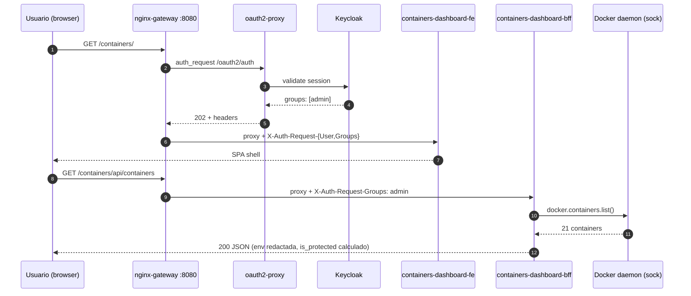
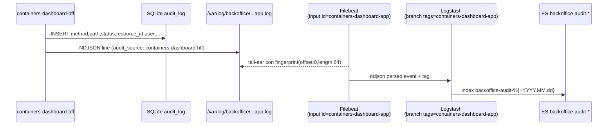

# Containers Dashboard — Manual de uso

> Microfrontend del BackOffice para gestionar el daemon Docker del host.
> Sub-stack de BackOffice. Coexiste con Portainer. Audit unificado en ELK.

**Versión MVP** · Container, image, volume, network: list / detail / start-stop-restart / exec / remove. SSE para logs y stats live. WS para exec shell.

---

## Índice

- [Parte 1 — Manual de usuario](#parte-1--manual-de-usuario)
  - [1.1 ¿Qué es?](#11-qué-es)
  - [1.2 Roles y permisos](#12-roles-y-permisos)
  - [1.3 Primer acceso](#13-primer-acceso)
  - [1.4 Listar containers / images / volumes / networks](#14-listar-containers--images--volumes--networks)
  - [1.5 Detalle de un container](#15-detalle-de-un-container)
  - [1.6 Logs y stats live](#16-logs-y-stats-live)
  - [1.7 Start / Stop / Restart](#17-start--stop--restart)
  - [1.8 Exec shell](#18-exec-shell)
  - [1.9 Remove (containers / images / volumes / networks)](#19-remove-containers--images--volumes--networks)
  - [1.10 Errores comunes](#110-errores-comunes)
  - [1.11 ¿Containers Dashboard o Portainer?](#111-containers-dashboard-o-portainer)
- [Parte 2 — Manual del operador del stack](#parte-2--manual-del-operador-del-stack)
  - [2.1 Arquitectura del sub-stack](#21-arquitectura-del-sub-stack)
  - [2.2 Arranque y parada](#22-arranque-y-parada)
  - [2.3 Modelo de seguridad](#23-modelo-de-seguridad)
  - [2.4 Audit pipeline (SQLite + ELK)](#24-audit-pipeline-sqlite--elk)
  - [2.5 Ficheros de configuración](#25-ficheros-de-configuración)
  - [2.6 Runbooks operativos](#26-runbooks-operativos)
  - [2.7 Limitaciones conocidas](#27-limitaciones-conocidas)
  - [2.8 Referencias](#28-referencias)

---

# Parte 1 — Manual de usuario

## 1.1 ¿Qué es?

Containers Dashboard expone, sobre HTTP corporativo `/containers/`, una SPA que permite:

- **Listar** todos los containers del host (corriendo o parados), images, volumes y networks.
- **Inspeccionar** un container: overview, logs (live SSE), stats CPU/MEM (live SSE), inspect JSON.
- **Operar**: start / stop / restart (admin + operator).
- **Diagnosticar**: abrir un shell exec dentro del container (admin).
- **Remover**: container / image / volume / network con confirmación tipo "type-the-name" (admin).

Toda acción queda **auditada** en `backoffice-audit-*` (Elasticsearch) y en SQLite local.



## 1.2 Roles y permisos

Heredados del BackOffice — **mismo grupo Keycloak `lglabs.*`**:

| Rol | Listings | Detail / Logs / Stats / Inspect | Start/Stop/Restart | Exec shell | Remove |
|---|---|---|---|---|---|
| `admin`    | ✅ | ✅ | ✅ | ✅ | ✅ |
| `operator` | ✅ | ✅ | ✅ | — (botón oculto) | — (botón oculto) |
| `support`  | ✅ | ✅ | — | — | — |
| `viewer`   | ✅ | ✅ | — | — | — |

Defense-in-depth: **gateway** (nginx) filtra por header `X-Auth-Request-Groups` antes de proxiar; **BFF** re-valida con `require_admin` / `require_writer` / `require_reader`. Si pasas el gateway pero el BFF te rechaza, ves un `403 forbidden` JSON; si te bloquea el gateway ves un HTML "Acceso denegado".

## 1.3 Primer acceso

1. `make backoffice-up` (incluye containers-dashboard).
2. Abre `http://localhost:8080/containers/`.
3. Login con `lglabsadmin` / `lgpass` (o cualquiera de los 4 seed users).
4. Verás el **home** del dashboard con tarjetas (Containers, Images, Volumes, Networks) + summary.

## 1.4 Listar containers / images / volumes / networks

- **Containers** (`#/containers`): tabla con state · name · image · compose project · ports. Filtros: búsqueda por texto, "ocultar parados". Click en fila → detalle.
- **Images** (`#/images`): repository · tag · id_short · size · contadores de containers que la usan.
- **Volumes** (`#/volumes`): name · driver · mountpoint · contadores de containers que lo montan.
- **Networks** (`#/networks`): name (con icono 🔒 si es builtin) · driver · scope · internal · containers attached · id_short.

Iconos en cada lista (sólo admin):
- 🗑 botón Remove (deshabilitado con tooltip si está protegido / en uso / builtin).

## 1.5 Detalle de un container

URL: `#/containers/<id_or_name>` con 4 tabs:

- **Overview** — id · image · status · compose project/service · restart policy · health · networks (IP/MAC) · mounts (type · source · target · mode).
- **Logs** — últimas N líneas (default 500). Botón "▶ Stream" abre SSE para logs en vivo. "⏸ Detener" cierra el stream.
- **Stats** — SSE per-second: CPU% · MEM% · MEM usage/limit · NET RX/TX · Block I/O.
- **Inspect** — JSON crudo (formateado), env redactada.

Botones de acción (top-right) sólo visibles para los roles permitidos:
- ▶ **Start**, ■ **Stop**, ↻ **Restart** (writer = admin|operator).
- ⌘ **Exec** (admin), 🗑 **Remove** (admin).

Container protegido por denylist → todos los botones de acción se deshabilitan con tooltip "🔒 protegido".

## 1.6 Logs y stats live

- Logs: GET `/containers/<id>/logs?tail=N` para snapshot; SSE `/containers/<id>/logs/stream?tail=200` para live tail. El SPA combina los dos.
- Stats: SSE `/containers/<id>/stats`, emisión per-second. Si el container se para, el stream se cierra silenciosamente.

Bajo el capó SSE en nginx-gateway: `proxy_buffering off`, `proxy_read_timeout 3600s`.

## 1.7 Start / Stop / Restart

- **Start**: 1 click. Sin modal de confirmación. Si ya está corriendo → 409 `already_running`.
- **Stop**: modal con typed-name + slider `timeout_seconds` (1–60). Sin confirmación → 409 `confirmation_required`.
- **Restart**: ídem Stop.

Tras la acción, el SPA hace polling 5x cada segundo del estado y refresca la tarjeta.

## 1.8 Exec shell

Sólo admin. Acceso desde botón ⌘ Exec en detalle (sólo si container `running` y no protegido). URL: `#/containers/<id>/exec`.

UX:
- Selector de shell: `sh` o `bash` (default `sh`). Otros valores → cierre WS con código `1008 invalid_shell`.
- Botón Connect → abre WebSocket.
- xterm.js con `FitAddon` (resize automático).
- Banner ámbar de aviso: "El contenido del shell **NO se persiste**, sólo `exec_open` / `exec_close` con metadatos (status, duración, exit_code, close_reason)".
- Idle 5min → desconexión automática (close_reason: `idle_timeout`).
- Salir con `Ctrl+D` o el botón Disconnect.

## 1.9 Remove (containers / images / volumes / networks)

Sólo admin. Modal de confirmación:

1. Type-the-name: hay que escribir el nombre exacto en el input.
2. Header `X-Confirm-Resource: <name>` enviado por el SPA → 409 si falla.
3. Checkboxes opcionales según el tipo:
   - **Container**: `force` (mata el proceso si está corriendo) + `remove_volumes` (anonymous volumes).
   - **Image**: `force` (borra aunque esté en uso por otros containers).
   - **Volume / Network**: sin checkboxes — el servidor rechaza con 409 `volume_in_use` / `network_in_use` si está en uso. Cleanup manual.

Errores específicos:
- 423 `protected_resource` — container en denylist (no se puede borrar).
- 403 `builtin_network_protected` — bridge / host / none.
- 409 `container_running` — sin force.
- 409 `image_in_use` — `details.used_by` lista los containers que la usan.
- 409 `volume_in_use` — montado por algún container.
- 409 `network_in_use` — `details.attached` lista los containers conectados.

## 1.10 Errores comunes

| Error UI | Causa | Solución |
|---|---|---|
| 401 / login redirect | sesión expirada o no logueado | re-loguear; tokens TTL 5min en lab |
| 403 HTML "Acceso denegado" | gateway: tu rol no permite ese endpoint | verifica el rol; pide cambio a admin |
| 403 JSON `forbidden` | BFF rechazó pese al gateway | bug → reportar |
| 409 `confirmation_required` | falta header X-Confirm-Resource | el SPA lo envía; si pasó es bug del browser |
| 423 `protected_resource` | acción sobre container en denylist | usa `docker` CLI directamente si realmente lo necesitas |
| 1008 `invalid_shell` (WS) | shell distinto a sh/bash | usa sh o bash |
| 1008 `protected_resource` (WS) | exec en container denylisted | imposible por diseño |
| EventSource `onerror` | container parado durante stream | normal, cierra el SSE |

## 1.11 ¿Containers Dashboard o Portainer?

| Caso | Usa |
|---|---|
| Operación de equipo con audit centralizado en ELK + RBAC SSO | **Containers Dashboard** |
| Self-protection (no romper el BackOffice por accidente) | **Containers Dashboard** |
| Stacks editor / multi-host / swarm / build pipelines / registry UI | **Portainer** |
| Vista 360° avanzada de Docker | **Portainer** |

Ambos coexisten en el mismo BackOffice (`/containers/` y `/portainer/`).

---

# Parte 2 — Manual del operador del stack

## 2.1 Arquitectura del sub-stack

```mermaid
flowchart LR
  subgraph backoffice
    GW[nginx-gateway :8080]
    PRX[oauth2-proxy]
    KC[Keycloak]
    HOME[home FE]
    PORT[Portainer]
    KFE[kafka-dashboard FE]
    KBFF[kafka-dashboard BFF]
    CFE[containers-dashboard FE<br/>nginx + Alpine + xterm.js]
    CBFF[containers-dashboard BFF<br/>FastAPI + docker-py]
  end
  subgraph elk
    FB[Filebeat]
    LS[Logstash]
    ES[(Elasticsearch<br/>backoffice-audit-*)]
    KB[Kibana]
  end
  SOCK[/var/run/docker.sock]
  VAUDIT[(vol backoffice-audit-logs)]
  VDATA[(vol backoffice-containers-dashboard-data<br/>SQLite audit_log)]

  GW --> PRX --> KC
  GW --> HOME
  GW --> PORT
  GW --> KFE & KBFF
  GW -- /containers/ --> CFE
  GW -- /containers/api/ + WS exec --> CBFF
  CBFF -- "rw" --> SOCK
  CBFF --> VDATA
  CBFF -- NDJSON --> VAUDIT
  PRX -- access logs --> VAUDIT
  KBFF -- NDJSON --> VAUDIT
  VAUDIT --> FB --> LS --> ES --> KB
```

| Componente | Image | Puerto interno | Volúmenes |
|---|---|---|---|
| `containers-dashboard-fe` | nginx:1.27-alpine + bind-mount `frontend/` | 80 | — |
| `containers-dashboard-bff` | python:3.12-slim + `bff/` build | 8000 | `backoffice-containers-dashboard-data` (SQLite), `backoffice-audit-logs` (audit NDJSON), `/var/run/docker.sock:rw` |

Nombres de container: `lg-infra-backoffice-containers-dashboard-{fe,bff}`. Network: `lg-backoffice` (compartido con el resto del BackOffice).

## 2.2 Arranque y parada

```bash
# Pre-requisitos
make elk-up

# Levantar BackOffice (incluye containers-dashboard via include:)
make backoffice-up

# Parar (mantiene volúmenes)
make backoffice-down

# Destruir (incluye `backoffice-containers-dashboard-data`)
make backoffice-clean
```

Restart sólo del sub-stack:
```bash
docker compose -f backoffice/docker-compose.yml restart \
  containers-dashboard-bff containers-dashboard-fe
```

Frontend es bind-mount → cambios en `frontend/` se reflejan al instante (sin rebuild). BFF requiere `docker compose build containers-dashboard-bff && up -d` para cambios de código Python.

## 2.3 Modelo de seguridad

**Privilegio**: BFF tiene `docker.sock:rw` (mismo nivel de privilegio que el daemon). Mitigaciones:

1. **Denylist** (`bff/app/safety/denylist.py`). Hard-coded — NO env, NO YAML, NO runtime override:
   - `lg-infra-backoffice-keycloak`
   - `lg-infra-backoffice-gateway`
   - `lg-infra-backoffice-proxy` (oauth2-proxy)
   - `lg-infra-backoffice-portainer`
   - `lg-infra-backoffice-containers-dashboard-bff`
   - `lg-infra-backoffice-containers-dashboard-fe`

   Cualquier intento de stop/restart/exec/remove sobre uno de estos → HTTP 423 `protected_resource`.

2. **Roles asimétricos**: `exec` y `remove` son **admin-only**, start/stop/restart son admin+operator.

3. **Confirmación obligatoria**: header `X-Confirm-Resource: <name>` exigido en todas las mutaciones excepto `start`. Mismatch → 409 `confirmation_required`.

4. **Builtin networks**: bridge / host / none → 403 `builtin_network_protected` ante DELETE.

5. **Env redaction**: regex `(?i)(password|secret|token|key|credential)` aplicado server-side en `/containers/<id>` → valor reemplazado por `<redacted>` antes de salir del BFF.

6. **Exec content NO persistido**: sólo metadatos (`exec_open` con shell+container; `exec_close` con duration_ms, exit_code, close_reason). Ver §2.4.

7. **Idle timeout exec**: 5 minutos sin frames → cierre WS con `close_reason: idle_timeout`.

8. **Defense-in-depth**: nginx-gateway filtra por header `X-Auth-Request-Groups`; BFF re-valida con dependencies FastAPI.

## 2.4 Audit pipeline (SQLite + ELK)

Doble sink (mismo evento):

1. **SQLite local** (`/data/containers-dashboard.sqlite`, tabla `audit_log`) — útil para troubleshoot rápido sin ES.
2. **NDJSON file** (`/var/log/backoffice/containers-dashboard-app.log`, RotatingFileHandler 10MB×5) → Filebeat tail → Logstash → ES `backoffice-audit-YYYY.MM.dd`.

Discriminación en ES: campo `audit_source: "containers-dashboard-bff"` dentro del doc (los oauth2-proxy y kafka-dashboard usan otros valores). Coexisten en el mismo índice.



Tipos de evento (campo `audit_type`):
- `request` — toda mutación HTTP (POST/DELETE) o lectura sensible. Campos: `method`, `path`, `original_uri`, `status`, `duration_ms`, `resource_type`, `resource_id`, `request_id`, `user`, `groups`.
- `exec_open` — apertura WS exec. Campos: `container`, `shell`.
- `exec_close` — cierre WS exec. Campos: `duration_ms`, `exit_code`, `close_reason`.

> **Sobre el campo `user`**: bajo bearer-token (smoke scripts) oauth2-proxy NO propaga `X-Auth-Request-User` al BFF, así que aparece `null`. Bajo cookie de sesión browser sí se propaga. Esto es el mismo comportamiento que kafka-dashboard. El campo `groups` siempre está disponible.

## 2.5 Ficheros de configuración

| Path | Propósito |
|---|---|
| `docker-compose.yml` (sub) | Servicios `containers-dashboard-{fe,bff}` |
| `bff/Dockerfile` | python:3.12-slim + deps |
| `bff/app/settings.py` | Pydantic settings (env-overridable) |
| `bff/app/main.py` | FastAPI bootstrap + audit logger |
| `bff/app/middleware/audit.py` | HTTP middleware → SQLite + NDJSON |
| `bff/app/repos/docker_repo.py` | Cliente docker-py + lógica de protección |
| `bff/app/safety/denylist.py` | **Hard-coded** denylist |
| `bff/app/safety/confirm.py` | `X-Confirm-Resource` enforcement |
| `bff/app/routers/*.py` | containers, images, volumes, networks, exec, summary, health |
| `bff/app/repos/migrations/001_initial.sql` | SQLite schema (`audit_log`) |
| `frontend/index.html` | SPA monolítica (Alpine + Tailwind + xterm.js) |
| `frontend/assets/` | app.js, app.css, alpine.min.js, tailwind.min.js, xterm.js, xterm-addon-fit.js |
| `frontend/nginx.conf` | nginx config del FE |
| `../../../home/nginx.conf` | gateway: 4 locations `/containers/*` (ver al buscar `containers/`) |
| `../../../../elk/filebeat.yml` | input `containers-dashboard-app` |
| `../../../../elk/logstash.conf` | branch `containers-dashboard-app` |

## 2.6 Runbooks operativos

### R1. BFF no responde (502/503 desde gateway)

```bash
# Diagnóstico
docker ps --filter name=containers-dashboard
docker logs --tail 50 lg-infra-backoffice-containers-dashboard-bff

# Recuperación
docker compose -f backoffice/docker-compose.yml restart containers-dashboard-bff
sleep 5
curl -s http://localhost:8080/containers/api/health   # debe responder 200
```

### R2. Docker daemon no accesible desde BFF

Síntoma: `docker daemon unreachable` en logs / 503.
```bash
ls -la /var/run/docker.sock                                 # debe existir
docker exec lg-infra-backoffice-containers-dashboard-bff \
  ls -la /var/run/docker.sock                                # debe estar bind-mounted
```
En macOS: si Docker Desktop reinició, restartar el container BFF tras 5s.

### R3. Filebeat no envía eventos del BFF

```bash
docker logs --tail 30 filebeat01 | grep containers-dashboard-app
# Verifica que el input esté arrancado: "Input 'filestream' starting" id=containers-dashboard-app
```
Si no aparece: revisar `elk/filebeat.yml` y reiniciar:
```bash
docker compose -f elk/docker-compose.yml restart filebeat01
```

### R4. ES no indexa containers-dashboard-bff

Forzar generación de eventos + verificar:
```bash
bash backoffice/dashboards/containers-dashboard/bff/tests/scripts/smoke-g.sh
```
Si G.3 ó G.4 fallan: revisar `elk/logstash.conf` (branch `containers-dashboard-app` debe estar) y reiniciar logstash.

### R5. SQLite corrupto

```bash
# Backup + reset (PIERDE audit local; ES sigue intacto)
docker compose -f backoffice/docker-compose.yml stop containers-dashboard-bff
docker run --rm -v backoffice-containers-dashboard-data:/data -v $PWD:/backup alpine \
  tar czf /backup/sqlite-$(date +%s).tgz -C /data .
docker volume rm backoffice-containers-dashboard-data
docker compose -f backoffice/docker-compose.yml up -d containers-dashboard-bff
# La migración 001 corre automáticamente.
```

### R6. Container del propio dashboard "se borró"

No es posible: la denylist incluye `lg-infra-backoffice-containers-dashboard-{bff,fe}`. Si pasó, es bug — abre issue.

### R7. Usuario admin queda sin shell exec disponible

WS exec falla con HTTP 403 antes del Upgrade → comprobar grupo `admin` en token Keycloak:
```bash
curl -s -X POST "http://localhost:8083/keycloak/realms/lglabs/protocol/openid-connect/token" \
  -d "grant_type=password&client_id=oauth2-proxy&client_secret=lgpass-oidc-secret-change-me&username=lglabsadmin&password=lgpass" \
  | python3 -c "import sys,json,base64; t=json.load(sys.stdin)['access_token'].split('.')[1]; print(json.loads(base64.b64decode(t+'==')).get('groups'))"
# Debe imprimir ['admin']
```

## 2.7 Limitaciones conocidas

| ID | Limitación | Mitigación / workaround |
|---|---|---|
| L1 | El BFF tiene `docker.sock:rw` (igual que Portainer) | Denylist + RBAC + audit; mismo nivel de privilegio que Portainer |
| L2 | oauth2-proxy access log registra `/oauth2/auth` no la URI original | El BFF emite `original_uri` en su NDJSON propio |
| L3 | `X-Auth-Request-User` no se propaga bajo bearer-token (sí bajo cookie) | `groups` sí está disponible; mismo comportamiento que kafka-dashboard |
| L4 | Exec content NO persiste (sólo metadatos) | Decisión de seguridad consciente — ver §B7 specs |
| L5 | Stats SSE consume CPU del BFF | Cierre automático cuando el browser cierra el EventSource |
| L6 | Sin compose stacks editor / multi-host / swarm / build / registry UI | Usar Portainer (coexiste) |
| L7 | Sin filtro de containers (todo el host visible) | RBAC + denylist en lugar de whitelist |
| L8 | Idle timeout exec hard-coded a 5min | Cambiar `EXEC_IDLE_TIMEOUT_S` en settings + rebuild |
| L9 | Logs streaming no persiste history en re-stream | Tail snapshot + stream son operaciones distintas |

## 2.8 Referencias

- specs internos: `specs/{requirements,design,tasks,smoke-tests,backlog}.md` y `specs/CONSTITUTION-addendum.md`
- BackOffice MVP: `backoffice/docs/user-guide.es.md`
- Kafka Dashboard (sibling sub-stack): `backoffice/dashboards/kafka-dashboard/docs/user-guide.es.md`
- ELK platform: `elk/{docker-compose.yml, filebeat.yml, logstash.conf}`
- docker-py 7.x: https://docker-py.readthedocs.io/en/stable/
- xterm.js 5.3: https://xtermjs.org/
- FastAPI WebSocket: https://fastapi.tiangolo.com/advanced/websockets/
