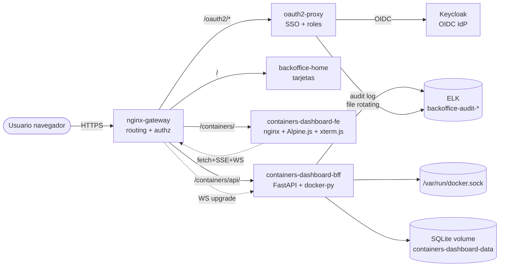
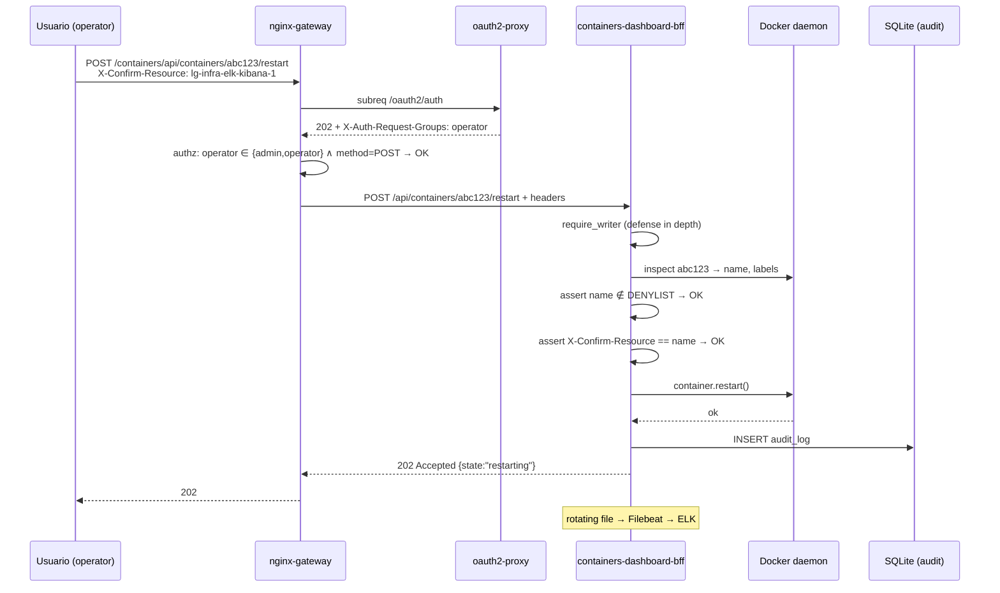
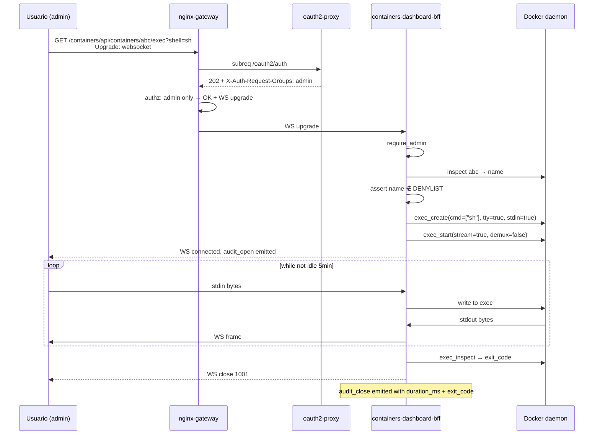

# Containers Dashboard — Design

> Versión: 0.1.0 · Estado: Approved · Última actualización: 2026-05-10
>
> Este documento define **cómo** se construye el Containers Dashboard. El **qué** está en `requirements.md`. Las decisiones inmutables están en `CONSTITUTION-addendum.md` (que hereda `backoffice/CONSTITUTION.md`).
>
> Cada sección de diseño debe ser verificable: o se mapea a código/config, o se mapea a un test en `smoke-tests.md`.

---

## 1. Arquitectura

### 1.1. Posición en el ecosistema



### 1.2. Flujo de una request mutadora (restart container)



### 1.3. Flujo de una sesión exec (admin only)



### 1.4. Decisiones arquitectónicas clave

| ID | Decisión | Razón |
|---|---|---|
| AD-1 | **Frontend separado del BFF** (dos contenedores) | nginx ya está como base estable; BFF puede reiniciarse sin tirar la UI estática. Mismo patrón que kafka-dashboard. |
| AD-2 | **BFF con FastAPI** (no Flask, no Django) | OpenAPI gratis; pydantic ya valida lo del frontend; soporta WebSocket nativo (necesario para exec). Mismo stack que kafka-dashboard. |
| AD-3 | **docker-py** (`docker` PyPI), no Docker Engine API HTTP raw ni `docker` CLI subprocess | Cliente oficial Python, mantiene compatibilidad con versiones, expone WS para exec sin reinventar. |
| AD-4 | **SQLite local en volumen**, no Postgres compartido | Coherente con kafka-dashboard §A2; el único estado del BFF es el audit log local (rotado a fichero también). |
| AD-5 | **Authz en nginx**, no en BFF | Coherente con el resto del BackOffice. El BFF redobla con `require_admin`/`require_writer` como defense-in-depth (§B3). |
| AD-6 | **Audit doble**: oauth2-proxy (SSO subreq) + BFF (URI original + recurso) | Igual que kafka-dashboard §A8. Cubre limitación L2 del BackOffice. |
| AD-7 | **xterm.js vendored para exec** | UX terminal aceptable sin build step. Versión 5.x. WS bidireccional sin librería extra. |
| AD-8 | **Denylist hard-coded en código** (no env, no YAML) | Self-protection no debe poder desactivarse por config (§B5, §7.1 requirements). |
| AD-9 | **Stats vía SSE, no polling** | Stream natural de docker-py `stats(stream=True)`. Cliente abre/cierra; servidor cancela el iterator al desconectar. |
| AD-10 | **No autodetección de shell en exec** | Selector explícito `[sh, bash, ash]`. Detección automática requiere probe → complejidad sin valor en lab. |

---

## 2. Componentes

### 2.1. Mapa de servicios docker-compose

| Servicio | Imagen | Puerto host | Networks | Volumes |
|---|---|---|---|---|
| `containers-dashboard-fe` | `nginx:1.27-alpine` | — (interno) | `lg-backoffice` | `./frontend:/usr/share/nginx/html:ro` |
| `containers-dashboard-bff` | build local (Dockerfile) | — (interno) | `lg-backoffice` | `containers-dashboard-data:/data`, **`/var/run/docker.sock:/var/run/docker.sock:rw`**, `backoffice-audit-logs:/var/log/backoffice:rw` |

> Nombres reales de containers: `lg-infra-backoffice-containers-dashboard-fe` y `lg-infra-backoffice-containers-dashboard-bff` (siguiendo convención del BackOffice).
>
> ⚠️ **Privilegio**: el BFF monta `docker.sock` en modo `rw`. Esto da acceso root al host por diseño (igual que el container `portainer` existente). Mitigaciones obligatorias en §B3 + §B5 del addendum.

### 2.2. Frontend (`containers-dashboard-fe`)

- **Stack**: HTML estático + Alpine.js 3.14 (vendored) + Tailwind CSS 3.4 JIT browser (vendored) + xterm.js 5.x (vendored) — sin build.
- **Ruta servida**: el gateway proxea `/containers/` → `containers-dashboard-fe:80/`. La UI usa rutas relativas.
- **SPA single-page con hash router** (igual patrón final de kafka-dashboard): `index.html` + `assets/`.

```
frontend/
├── index.html              # SPA con todas las views
├── assets/
│   ├── alpine.min.js       # vendored 3.14.x
│   ├── tailwind.min.js     # vendored 3.4.x JIT browser
│   ├── xterm.js            # vendored 5.x
│   ├── xterm-addon-fit.js  # vendored
│   ├── xterm.css
│   └── app.js              # helpers: kd.call, humanizeError, hash router, fmt, toast
└── nginx.conf              # solo expone /, no proxy
```

**Views del hash router:**

| Hash | View | Descripción |
|---|---|---|
| `#/` | home | Summary cards: counts, daemon version, links |
| `#/containers` | containers-list | Tabla paginada con filtro |
| `#/containers/<id>` | container-detail | Tabs: Overview / Logs / Stats / Inspect |
| `#/containers/<id>/exec` | container-exec | xterm.js terminal (admin only) |
| `#/images` | images-list | Tabla read-only + remove (admin) |
| `#/volumes` | volumes-list | Tabla read-only + remove (admin) |
| `#/networks` | networks-list | Tabla read-only + remove (admin) |

### 2.3. BFF (`containers-dashboard-bff`)

- **Stack**: Python 3.12 + FastAPI 0.115 + `docker` (docker-py) 7.x + sqlmodel + pydantic 2 + websockets.
- **Estructura `bff/`**:

```
bff/
├── Dockerfile
├── requirements.txt
├── pyproject.toml
├── app/
│   ├── main.py                   # FastAPI factory + lifespan
│   ├── deps.py                   # auth deps (extrae headers oauth2-proxy)
│   ├── settings.py               # pydantic-settings
│   ├── errors.py                 # excepciones + handlers (envelope)
│   ├── safety/
│   │   ├── denylist.py           # DENYLIST set + assert_not_protected()
│   │   └── redact.py             # regex SECRET_RE + redact_env()
│   ├── middleware/
│   │   ├── audit.py              # request → audit_log row + rotating file (igual a kafka-dashboard)
│   │   └── timing.py             # request_id + duration_ms
│   ├── routers/
│   │   ├── health.py             # GET /api/health
│   │   ├── summary.py            # GET /api/summary
│   │   ├── containers.py         # CRUD + logs + stats SSE
│   │   ├── exec.py               # WS /api/containers/{id}/exec
│   │   ├── images.py
│   │   ├── volumes.py
│   │   └── networks.py
│   ├── repos/
│   │   ├── docker_repo.py        # docker-py wrapper + retry/timeout
│   │   ├── audit_repo.py         # SQLite writes (idempotente como kafka-dashboard)
│   │   └── migrations/
│   │       └── 001_initial.sql   # audit_log table
│   └── models/
│       ├── domain.py             # pydantic domain models
│       └── db.py                 # sqlmodel tables
└── tests/
    ├── unit/
    └── contract/
```

- **Endpoint base**: el BFF se monta en `/api` internamente; el gateway añade `/containers/api/` → `bff:8000/api/`.

### 2.4. Persistencia (`containers-dashboard-data` volume)

- Volumen Docker named, NO bind mount.
- Contiene `app.db` (SQLite, sólo audit_log).
- Backup: documentado como receta manual en runbook (no Makefile target — coherente con kafka-dashboard fase G.4).

### 2.5. Logs y rotación

- **Stdout** (uvicorn access + app logs) → `docker logs` para troubleshooting normal.
- **Audit dedicado** (`logger="containers_dashboard.audit"`) → `RotatingFileHandler` 50 MiB × 3 backups → `/var/log/backoffice/containers-dashboard-app.log` (volumen `backoffice-audit-logs` compartido con kafka-dashboard).
- **Filebeat** (existente en stack ELK) tendrá un nuevo input que tail-ea ese path con tag `containers-dashboard-app`.

---

## 3. Contratos API

> Todos los endpoints viven bajo `/containers/api/` desde fuera, `/api/` dentro del BFF. Todos devuelven JSON salvo SSE/WS. Errores siguen el envelope §7.

### 3.1. Health

#### `GET /api/health`

| Campo | Detalle |
|---|---|
| Auth | público (no pasa por oauth2-proxy auth_request) |
| Response 200 | `{"status":"ok","docker":"ok\|degraded","sqlite":"ok"}` |
| Response 503 | mismo schema con `status:"degraded"` |

### 3.2. Summary (US-9)

#### `GET /api/summary`

| Campo | Detalle |
|---|---|
| Auth | requerido (todos los roles) |
| Response 200 | ver schema abajo |

```json
{
  "containers": {"total": 17, "running": 14, "exited": 3, "paused": 0, "restarting": 0, "created": 0},
  "images_total": 32,
  "volumes_total": 12,
  "networks_total": 7,
  "daemon_version": "27.3.1",
  "daemon_api_version": "1.47",
  "images_size_mb": 4123.4,
  "components": {"docker":"ok", "sqlite":"ok"}
}
```

### 3.3. Containers (US-1..US-6)

#### `GET /api/containers`

| Campo | Detalle |
|---|---|
| Auth | requerido (todos) |
| Query | `?include_stopped=true&search=&page=1&page_size=50` |
| Response 200 | `{items: ContainerSummary[], total, page, page_size}` |

`ContainerSummary`:
```json
{
  "id": "abc123def456",
  "id_short": "abc123def456"[:12],
  "name": "lg-infra-elk-kibana-1",
  "image": "kibana:8.13.0",
  "image_id": "sha256:...",
  "state": "running",
  "status": "Up 9 hours (healthy)",
  "compose_project": "lg-infra-elk",
  "compose_service": "kibana",
  "ports": [{"private": 5601, "public": 5601, "type": "tcp", "ip": "0.0.0.0"}],
  "labels_lglabs": {"lglabs.tier": "monitoring"},
  "is_protected": false,
  "created": "2026-05-10T03:00:00Z"
}
```

#### `GET /api/containers/{id}`

| Campo | Detalle |
|---|---|
| Auth | requerido (todos) |
| Response 200 | `ContainerDetail` |
| Response 404 | si no existe |

`ContainerDetail` extiende `ContainerSummary` con:
```json
{
  "image_digest": "sha256:...",
  "command": ["./entrypoint.sh"],
  "env": [{"key": "NODE_ENV", "value": "production"}, {"key": "DB_PASSWORD", "value": "<redacted>"}],
  "mounts": [{"type": "bind", "source": "...", "target": "...", "mode": "rw"}],
  "networks": [{"name": "lg-backoffice", "ip": "172.20.0.5", "mac": "..."}],
  "labels": {"...all labels..."},
  "restart_policy": {"name": "unless-stopped", "max_retries": 0},
  "health": {"status": "healthy", "failing_streak": 0}
}
```

#### `GET /api/containers/{id}/logs`

| Campo | Detalle |
|---|---|
| Auth | requerido (todos) |
| Query | `?tail=500&since=&timestamps=false` |
| Response 200 | `{"lines": ["...", ...], "tail": 500, "truncated": false}` |

`tail`: 1..2000 (default 500).

#### `GET /api/containers/{id}/logs/stream`

SSE stream. Cliente hace `EventSource`. Cada evento `data:` contiene una línea JSON `{"line":"...","ts":"..."}`.

#### `GET /api/containers/{id}/stats`

SSE stream. Cada evento (~1s) `data:` contiene:
```json
{"cpu_percent": 12.4, "memory_usage_mb": 256, "memory_limit_mb": 512, "net_rx_kbps": 0.5, "net_tx_kbps": 0.2, "block_read_mb": 0.1, "block_write_mb": 0.0}
```

Si `state != running`, responde `200` con un único evento `{"unavailable": true, "reason": "container_not_running"}` y cierra.

#### `GET /api/containers/{id}/inspect`

| Campo | Detalle |
|---|---|
| Auth | requerido (todos) |
| Response 200 | output crudo de `docker inspect` con env redactado |

#### `POST /api/containers/{id}/start`

| Campo | Detalle |
|---|---|
| Auth | admin, operator |
| Headers | (ninguno extra) |
| Response 202 | `{"id": "...", "state": "running"}` |
| Response 423 | `protected_resource` si en denylist |
| Response 409 | `already_running` |

#### `POST /api/containers/{id}/stop`

| Campo | Detalle |
|---|---|
| Auth | admin, operator |
| Query | `?timeout_seconds=10` (1..60) |
| Headers | `X-Confirm-Resource: <name>` |
| Response 202 | `{"id": "...", "state": "exited"}` |
| Response 409 | `confirmation_required` o `already_stopped` |
| Response 423 | `protected_resource` |

#### `POST /api/containers/{id}/restart`

| Campo | Detalle |
|---|---|
| Auth | admin, operator |
| Query | `?timeout_seconds=10` |
| Headers | `X-Confirm-Resource: <name>` |
| Response 202 | `{"id": "...", "state": "restarting"}` |
| Response 409 | `confirmation_required` |
| Response 423 | `protected_resource` |

#### `DELETE /api/containers/{id}`

| Campo | Detalle |
|---|---|
| Auth | **admin only** |
| Query | `?force=false&remove_volumes=false` |
| Headers | `X-Confirm-Resource: <name>` |
| Response 204 | éxito |
| Response 409 | `container_running` (sin force), `confirmation_required` |
| Response 423 | `protected_resource` |

#### `WS /api/containers/{id}/exec`

| Campo | Detalle |
|---|---|
| Auth | **admin only** |
| Query | `?shell=sh` (enum: sh, bash, ash) |
| Frames cliente → servidor | bytes UTF-8 (stdin) o JSON `{"resize": {"cols": 80, "rows": 24}}` |
| Frames servidor → cliente | bytes UTF-8 (stdout/stderr mux) |
| Close codes | `1000` normal, `1001` idle timeout, `1011` daemon error |
| Idle timeout | 5 min (configurable env `EXEC_IDLE_TIMEOUT_S=300`) |

Audit:
- Al abrir: `audit_type=exec_open`, `resource_type=container`, `resource_name=<name>`, `details={shell, command_id}`.
- Al cerrar: `audit_type=exec_close`, `details={duration_ms, exit_code, close_reason}`.
- Stream content: NO se persiste.

### 3.4. Images (US-7, US-8)

#### `GET /api/images`

`{items: [{id, repository, tag, size_mb, created, containers_using}], total, page, page_size}`.

#### `DELETE /api/images/{id}`

| Auth | **admin only** |
|---|---|
| Query | `?force=false&prune_children=false` |
| Headers | `X-Confirm-Resource: <repository:tag>` o `<id_short>` |
| Response 204 | éxito |
| Response 409 | `image_in_use` (sin force) |

### 3.5. Volumes (US-7, US-8)

#### `GET /api/volumes`

`{items: [{name, driver, mountpoint, created, size_mb, containers_using}], total, page, page_size}`.

> `size_mb` se calcula con `docker system df -v` style; cacheado 60s para no tirar el daemon.

#### `DELETE /api/volumes/{name}`

| Auth | **admin only** |
|---|---|
| Headers | `X-Confirm-Resource: <name>` |
| Response 204 | éxito |
| Response 409 | `volume_in_use` (sin force, NO existe force aquí — §AC-8.3) |

### 3.6. Networks (US-7, US-8)

#### `GET /api/networks`

`{items: [{id, name, driver, scope, internal, containers_attached, is_builtin}], total, page, page_size}`.

#### `DELETE /api/networks/{id}`

| Auth | **admin only** |
|---|---|
| Headers | `X-Confirm-Resource: <name>` |
| Response 204 | éxito |
| Response 403 | `builtin_network_protected` (bridge/host/none) |
| Response 409 | `network_in_use` |

---

## 4. Modelo SQLite

### 4.1. DDL

```sql
CREATE TABLE IF NOT EXISTS _schema_version (
    version INTEGER PRIMARY KEY,
    applied_at TEXT NOT NULL DEFAULT (datetime('now'))
);

CREATE TABLE IF NOT EXISTS audit_log (
    id            INTEGER PRIMARY KEY AUTOINCREMENT,
    ts            TEXT NOT NULL DEFAULT (datetime('now')),
    request_id    TEXT,
    audit_source  TEXT NOT NULL DEFAULT 'containers-dashboard-bff',
    audit_type    TEXT NOT NULL,             -- request|exec_open|exec_close
    user          TEXT NOT NULL,
    groups        TEXT,
    method        TEXT,
    path          TEXT,                      -- BFF path (/api/...)
    original_uri  TEXT,                      -- /containers/api/...
    status        INTEGER,
    duration_ms   INTEGER,
    resource_type TEXT,                      -- container|image|volume|network
    resource_id   TEXT,
    resource_name TEXT,
    detail        TEXT                       -- JSON opcional
);

CREATE INDEX IF NOT EXISTS idx_audit_ts          ON audit_log(ts);
CREATE INDEX IF NOT EXISTS idx_audit_user        ON audit_log(user);
CREATE INDEX IF NOT EXISTS idx_audit_request_id  ON audit_log(request_id);
CREATE INDEX IF NOT EXISTS idx_audit_audit_type  ON audit_log(audit_type);
```

> Nota: NO replicamos `audit_log` del kafka-dashboard 1:1 — aquí no hay `topic_metadata` ni `acl_metadata`. El único estado es el audit. Si en el futuro se quisiera anotar containers (igual que owners en topics), se añade en backlog.

---

## 5. Integración con el gateway

### 5.1. Bloques nginx nuevos en `backoffice/home/nginx.conf`

Patrón idéntico a kafka-dashboard, con dos diferencias:

1. **WS upgrade** habilitado en `/containers/api/containers/*/exec`.
2. Authz para exec: **admin only**. Authz para DELETE container/image/volume/network: **admin only**. Authz para POST start/stop/restart: admin+operator.

```nginx
upstream containers_dashboard_fe_upstream  { server containers-dashboard-fe:80; }
upstream containers_dashboard_bff_upstream { server containers-dashboard-bff:8000; }

# Frontend estático
location /containers/ {
    auth_request /oauth2/auth;
    error_page 401 = @redirect_to_login;
    auth_request_set $auth_user   $upstream_http_x_auth_request_user;
    auth_request_set $auth_groups $upstream_http_x_auth_request_groups;

    proxy_set_header Host              $http_host;
    proxy_set_header X-Real-IP         $remote_addr;
    proxy_set_header X-Forwarded-For   $proxy_add_x_forwarded_for;
    proxy_set_header X-Forwarded-Proto $scheme;
    proxy_set_header X-Auth-Request-User   $auth_user;
    proxy_set_header X-Auth-Request-Groups $auth_groups;

    proxy_pass http://containers_dashboard_fe_upstream/;
}

# WebSocket exec — admin only
location ~ ^/containers/api/containers/[^/]+/exec$ {
    auth_request /oauth2/auth;
    error_page 401 = @redirect_to_login;
    auth_request_set $auth_user   $upstream_http_x_auth_request_user;
    auth_request_set $auth_groups $upstream_http_x_auth_request_groups;

    if ($auth_groups !~ "(^|,)admin(,|$)") { return 403; }

    proxy_http_version 1.1;
    proxy_set_header Upgrade           $http_upgrade;
    proxy_set_header Connection        "upgrade";
    proxy_set_header Host              $http_host;
    proxy_set_header X-Auth-Request-User   $auth_user;
    proxy_set_header X-Auth-Request-Groups $auth_groups;
    proxy_set_header X-Original-URI        $request_uri;
    proxy_read_timeout 3600s;
    proxy_send_timeout 3600s;

    proxy_pass http://containers_dashboard_bff_upstream;
}

# API REST/SSE
location /containers/api/ {
    auth_request /oauth2/auth;
    error_page 401 = @redirect_to_login;
    auth_request_set $auth_user   $upstream_http_x_auth_request_user;
    auth_request_set $auth_groups $upstream_http_x_auth_request_groups;

    # Health pasa sin auth
    location = /containers/api/health {
        auth_request off;
        proxy_pass http://containers_dashboard_bff_upstream/api/health;
    }

    # Authz por método/path — usaremos `map` (no `if`) en implementación final.
    # Esquema lógico:
    #   GET/HEAD   → cualquier autenticado
    #   POST       → start/stop/restart: admin|operator
    #   DELETE     → admin only
    #   (exec WS lo maneja el location ~ de arriba)
    set $authz_required role_any;
    if ($request_method = POST)   { set $authz_required role_writer; }
    if ($request_method = DELETE) { set $authz_required role_admin; }
    # Implementación final con `map $request_method $authz_required` + `map $auth_groups $has_role`
    # (ver tasks Fase A.2.2)

    proxy_set_header Host                  $http_host;
    proxy_set_header X-Auth-Request-User   $auth_user;
    proxy_set_header X-Auth-Request-Groups $auth_groups;
    proxy_set_header X-Original-URI        $request_uri;
    # SSE necesita estos headers para no bufferear
    proxy_buffering    off;
    proxy_cache        off;
    proxy_read_timeout 3600s;

    proxy_pass http://containers_dashboard_bff_upstream/api/;
}
```

### 5.2. Tarjeta en home

`backoffice/home/index.html` añade tarjeta visible para los 4 roles. La authz fina la decide gateway+BFF.

```html
<a href="/containers/" class="card" data-roles="admin,operator,support,viewer">
  <h3>Containers Dashboard</h3>
  <p>Ver, reiniciar, inspeccionar y diagnosticar containers Docker del host.</p>
  <small>Docker daemon · self-protected</small>
</a>
```

> Convive con la tarjeta existente de Portainer (no la sustituye; ver §1 requirements "Coexistencia").

---

## 6. Matriz role × endpoint

| Endpoint | Method | admin | operator | support | viewer |
|---|---|:-:|:-:|:-:|:-:|
| `/api/health` | GET | ✅ | ✅ | ✅ | ✅ (sin auth) |
| `/api/summary` | GET | ✅ | ✅ | ✅ | ✅ |
| `/api/containers` | GET | ✅ | ✅ | ✅ | ✅ |
| `/api/containers/{id}` | GET | ✅ | ✅ | ✅ | ✅ |
| `/api/containers/{id}/logs` | GET | ✅ | ✅ | ✅ | ✅ |
| `/api/containers/{id}/logs/stream` | GET (SSE) | ✅ | ✅ | ✅ | ✅ |
| `/api/containers/{id}/stats` | GET (SSE) | ✅ | ✅ | ✅ | ✅ |
| `/api/containers/{id}/inspect` | GET | ✅ | ✅ | ✅ | ✅ |
| `/api/containers/{id}/start` | POST | ✅ | ✅ | ❌ | ❌ |
| `/api/containers/{id}/stop` | POST | ✅ | ✅ | ❌ | ❌ |
| `/api/containers/{id}/restart` | POST | ✅ | ✅ | ❌ | ❌ |
| `/api/containers/{id}` | DELETE | ✅ | ❌ | ❌ | ❌ |
| `/api/containers/{id}/exec` | WS | ✅ | ❌ | ❌ | ❌ |
| `/api/images` | GET | ✅ | ✅ | ✅ | ✅ |
| `/api/images/{id}` | DELETE | ✅ | ❌ | ❌ | ❌ |
| `/api/volumes` | GET | ✅ | ✅ | ✅ | ✅ |
| `/api/volumes/{name}` | DELETE | ✅ | ❌ | ❌ | ❌ |
| `/api/networks` | GET | ✅ | ✅ | ✅ | ✅ |
| `/api/networks/{id}` | DELETE | ✅ | ❌ | ❌ | ❌ |

> Esta tabla es el **contrato verificable**: `smoke-tests.md` ejecuta una request por cada celda con un usuario de cada rol.

---

## 7. Manejo de errores

### 7.1. Error envelope

```json
{
  "error": "<machine_code>",
  "message": "<human-readable, en inglés>",
  "details": { /* opcional, contexto */ }
}
```

### 7.2. Códigos de error definidos

| Code | HTTP | Origen |
|---|---|---|
| `invalid_payload` | 400 | pydantic validation |
| `invalid_query` | 400 | query params fuera de rango |
| `invalid_shell` | 400 | shell ∉ {sh,bash,ash} |
| `builtin_network_protected` | 403 | bridge/host/none |
| `container_not_found` | 404 | — |
| `image_not_found` | 404 | — |
| `volume_not_found` | 404 | — |
| `network_not_found` | 404 | — |
| `confirmation_required` | 409 | header ausente o no coincide |
| `container_running` | 409 | DELETE container running sin force |
| `already_running` | 409 | start sobre running |
| `already_stopped` | 409 | stop sobre stopped |
| `image_in_use` | 409 | DELETE image con containers |
| `volume_in_use` | 409 | DELETE volume montado |
| `network_in_use` | 409 | DELETE network con containers |
| `protected_resource` | 423 | denylist hit |
| `docker_unavailable` | 503 | socket no responde |

### 7.3. Mapeo docker-py exceptions

| docker-py exception | HTTP | error code |
|---|---|---|
| `docker.errors.NotFound` | 404 | `*_not_found` (depende del recurso) |
| `docker.errors.APIError` (status 409) | 409 | `*_in_use` o `container_running` |
| `docker.errors.ImageNotFound` | 404 | `image_not_found` |
| `docker.errors.NotFound` (pull) | 404 | n/a (no pull en MVP) |
| `requests.exceptions.ConnectionError` (socket) | 503 | `docker_unavailable` |
| `requests.exceptions.ReadTimeout` | 503 | `docker_unavailable` |
| (otra) | 500 | `internal_error` |

---

## 8. Audit

### 8.1. Doble fuente

| Fuente | Captura | Limitación |
|---|---|---|
| oauth2-proxy (existente) | quién, cuándo, status — pero `path=/oauth2/auth` (subreq) | L2 BackOffice |
| BFF (nuevo) | URI original + `resource_type/id/name` + `audit_type` (request/exec_open/exec_close) | sólo lo que llega al BFF |

Ambos acaban en `backoffice-audit-*`. `audit_source` discrimina (`oauth2-proxy` vs `containers-dashboard-bff`). **MISMO índice que kafka-dashboard** — el campo `audit_source` ya tiene 2 valores hoy, ahora tendrá 3.

### 8.2. Pipeline del BFF

```
BFF logger "containers_dashboard.audit" (JSON ndjson)
  └─→ RotatingFileHandler 50MB×3 → /var/log/backoffice/containers-dashboard-app.log
        └─→ filebeat input "containers-dashboard-app" (filestream, fingerprint.length=64)
              └─→ logstash conditional branch "containers-dashboard-app" in [tags]
                    └─→ ES backoffice-audit-YYYY.MM.dd
```

El volumen `backoffice-audit-logs` ya existe (compartido con kafka-dashboard). Sólo añadimos un input Filebeat y una rama Logstash.

### 8.3. Schema del evento BFF

```json
{
  "@timestamp": "2026-05-10T12:00:00.123Z",
  "audit_source": "containers-dashboard-bff",
  "audit_type": "request",
  "user": "lglabsoperator@lglabs.local",
  "groups": ["operator"],
  "method": "POST",
  "path": "/api/containers/abc123/restart",
  "original_uri": "/containers/api/containers/abc123/restart",
  "status": 202,
  "resource_type": "container",
  "resource_id": "abc123",
  "resource_name": "lg-infra-elk-kibana-1",
  "duration_ms": 142,
  "request_id": "uuid"
}
```

Para exec sessions (audit_type ∈ `exec_open|exec_close`), `details` lleva `{shell, command_id}` o `{duration_ms, exit_code, close_reason}`.

### 8.4. Sanitización

- NO request body en logs.
- Env values redactados server-side antes de loguear inspect.
- Stream content de exec NO se loguea (§B7).
- Cuando un endpoint loguea recurso, sólo identificadores (id, name, image:tag), no descripciones largas.

---

## 9. Configuración y secretos

### 9.1. `.env.example`

```bash
# containers-dashboard
CONTAINERS_DASHBOARD_BFF_MEM_LIMIT=256m
CONTAINERS_DASHBOARD_FE_MEM_LIMIT=64m
CONTAINERS_DASHBOARD_LOG_LEVEL=INFO
CONTAINERS_DASHBOARD_EXEC_IDLE_TIMEOUT_S=300
CONTAINERS_DASHBOARD_AUDIT_LOG_PATH=/var/log/backoffice/containers-dashboard-app.log
DOCKER_API_TIMEOUT_S=10
```

### 9.2. Variables internas

| Var | Default | Uso |
|---|---|---|
| `DOCKER_HOST` | `unix:///var/run/docker.sock` | docker-py client |
| `SQLITE_PATH` | `/data/app.db` | audit DB |
| `EXEC_IDLE_TIMEOUT_S` | `300` | WS idle timeout |
| `LOG_LEVEL` | `INFO` | logger Python |
| `BFF_PORT` | `8000` | puerto interno |
| `AUDIT_LOG_PATH` | `/var/log/backoffice/containers-dashboard-app.log` | rotating handler |

---

## 10. Healthchecks y memory limits

### 10.1. `containers-dashboard-bff`

```yaml
healthcheck:
  test: ["CMD", "wget", "-q", "-O-", "http://localhost:8000/api/health"]
  interval: 30s
  timeout: 5s
  retries: 3
  start_period: 20s
deploy:
  resources:
    limits:
      memory: ${CONTAINERS_DASHBOARD_BFF_MEM_LIMIT:-256m}
```

### 10.2. `containers-dashboard-fe`

```yaml
healthcheck:
  test: ["CMD", "wget", "-q", "-O-", "http://localhost/"]
  interval: 30s
  timeout: 3s
  retries: 3
  start_period: 5s
deploy:
  resources:
    limits:
      memory: ${CONTAINERS_DASHBOARD_FE_MEM_LIMIT:-64m}
```

### 10.3. Boot order

- `containers-dashboard-bff` no depende de otro servicio del BackOffice (solo del docker.sock que existe en el host).
- `containers-dashboard-fe` no depende de nadie.
- `nginx-gateway` resuelve upstreams al arrancar — el BackOffice debe levantar este sub-stack como parte del compose include.

---

## 11. Decisiones técnicas registradas

### 11.1. Sí

| ID | Decisión | Por qué |
|---|---|---|
| AD-1..10 | Ver §1.4 | — |
| AD-11 | OpenAPI auto en `/api/openapi.json` | Útil para tests de contrato |
| AD-12 | UUID v4 para `request_id` | Propagado en header `X-Request-Id`; correlación cross-fuente |
| AD-13 | docker-py con `timeout=10s` por default | Evita colgar el BFF si el daemon va lento |
| AD-14 | Stats SSE: backpressure por `asyncio.Queue(maxsize=10)` | Si cliente lento, descarta samples antiguos |

### 11.2. No

| ID | Rechazo | Por qué |
|---|---|---|
| AD-N1 | Compose stacks management | Lo cubre Portainer; añadirlo duplica esfuerzo |
| AD-N2 | Pull/push imágenes desde UI | Operación lenta, mejor en CI/CLI |
| AD-N3 | gRPC entre fe y bff | Es navegador, HTTP+JSON+WS es lo natural |
| AD-N4 | Caché de containers list (Redis o memoria) | docker.sock es local y rápido |
| AD-N5 | OPA / external authz engine | Overkill; nginx + headers + denylist suficiente |
| AD-N6 | Multi-host / Swarm | YAGNI |
| AD-N7 | Grabar contenido de exec | Compromiso de seguridad — §B7 |

---

## 12. Trazabilidad inversa

(Se completa al escribir `tasks.md`. Cada task referencia esta sección. Cada US referencia las tasks.)
