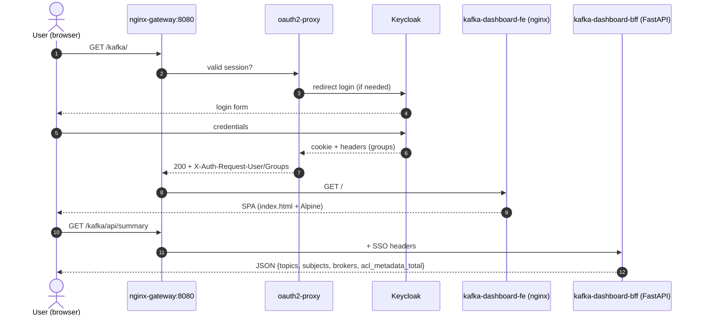
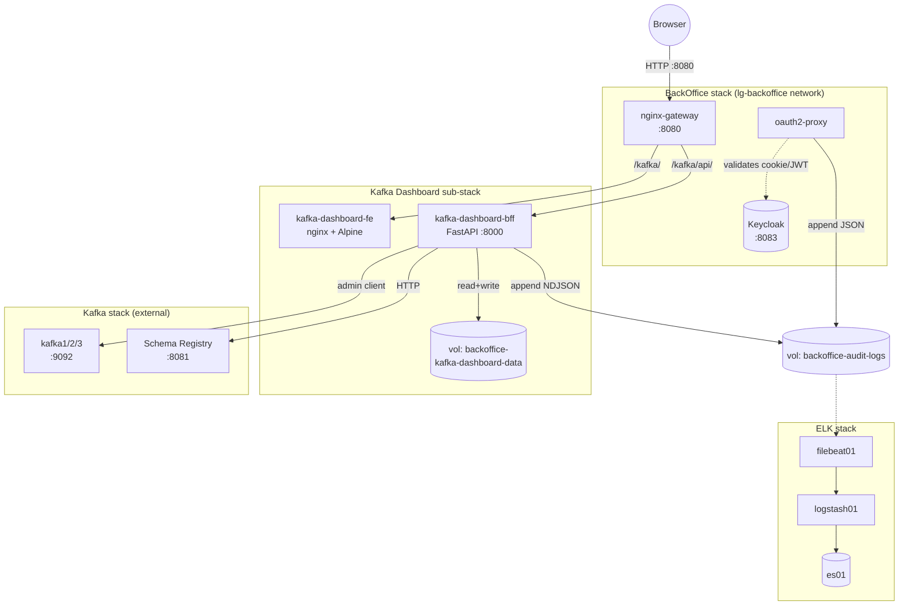

# Kafka Dashboard — User Guide

> 🇪🇸 **Versión en español**: [user-guide.es.md](user-guide.es.md)

BackOffice microfrontend (`/kafka/`) for declarative management of **topics**, **schemas** and **ACL-metadata** of the `lg-labs` Kafka cluster. Inherits SSO + roles from the BackOffice and emits audit to `backoffice-audit-*`.

---

## Table of contents

- [Part 1 — End-user manual](#part-1--end-user-manual)
  - [1.1 What is it?](#11-what-is-it)
  - [1.2 Roles and permissions](#12-roles-and-permissions)
  - [1.3 First access](#13-first-access)
  - [1.4 Create a topic](#14-create-a-topic)
  - [1.5 Edit / delete a topic](#15-edit--delete-a-topic)
  - [1.6 Schemas (Schema Registry)](#16-schemas-schema-registry)
  - [1.7 ACL-metadata (annotations)](#17-acl-metadata-annotations)
  - [1.8 JSON Export](#18-json-export)
  - [1.9 Common errors](#19-common-errors)
- [Part 2 — Stack operator manual](#part-2--stack-operator-manual)
  - [2.1 Sub-stack architecture](#21-sub-stack-architecture)
  - [2.2 Start and stop](#22-start-and-stop)
  - [2.3 `lglabs.*` convention and owners](#23-lglabs-convention-and-owners)
  - [2.4 Audit in ELK + SQLite](#24-audit-in-elk--sqlite)
  - [2.5 Configuration files](#25-configuration-files)
  - [2.6 Operational runbooks](#26-operational-runbooks)
  - [2.7 Known limitations](#27-known-limitations)
  - [2.8 References](#28-references)

---

# Part 1 — End-user manual

## 1.1 What is it?

A web UI for `lg-labs` teams to manage **topics**, **schemas** and **ACL annotations** of the Kafka cluster **without touching the CLI** and without needing admin permissions on the brokers. Use cases:

- **Create a topic** with the `lglabs.<domain>.<entity>` convention and a registered *owner*.
- **Modify configuration** of an existing topic (retention, compaction, partitions — increment only).
- **Register a schema** (Avro/Protobuf/JSON) in the Schema Registry and evolve it respecting compatibility.
- **Annotate ACLs** that the cluster does not yet enforce, as inventory for a future migration.
- **Export** the JSON definition of a topic + its schemas + its ACL-metadata for snapshot / disaster recovery / IaC reconciliation.

> ℹ️ To produce/consume messages use **AKHQ** (also inside the BackOffice, at `/akhq/`). This dashboard is **declarative**, not transactional.

## 1.2 Roles and permissions

The 4 SSO roles of the BackOffice (assigned in Keycloak) determine what each user can do:

| Role | Topics | Schemas | ACL-metadata | Export | Comment |
|---|---|---|---|---|---|
| `admin`    | CRUD | CRUD + set compatibility | **CRUD** | ✅ | Only role that creates/edits/deletes ACL-metadata |
| `operator` | CRUD | CRUD + set compatibility | read | ✅ | Day-to-day topic management |
| `support`  | read | read | read | ❌ | Investigation / forensic read |
| `viewer`   | read | read | read | ❌ | Demo / training access |

> ⚠️ Authorization is enforced in **two layers**: the `nginx-gateway` filters by the `X-Auth-Request-Groups` header, and the BFF re-checks via `require_admin` / `require_writer`. A request without a valid group receives **403** before reaching business logic.

## 1.3 First access

1. Open [http://localhost:8080/](http://localhost:8080/) in the browser.
2. Log in with one of the seed users:
   - `lglabsadmin` / `lglabsoperator` / `lglabssupport` / `lglabsviewer` — password `lgpass`.
3. On the home page the **Kafka Dashboard** card is shown → click → lands at `/kafka/`.
4. The SPA loads, calls `whoami` and `summary`, and displays the cluster summary.



## 1.4 Create a topic

1. Click **Topics** → **Create topic**.
2. **Name** — must respect `^lglabs\.[a-z0-9]([a-z0-9._-]*[a-z0-9])?$`. Example: `lglabs.payments.events`.
3. **Owner** — dropdown populated from `bff/config/owners.yaml`. If your team is not listed, open a PR against that file (creating owners from the UI is forbidden by design — owners are a controlled catalog).
4. **Partitions** — positive integer. Can only be **incremented** later.
5. **Replication factor** — integer ≤ number of brokers. Cannot be modified later.
6. **Retention** (ms) and **cleanup.policy** — `delete` or `compact`.
7. **Create** → 201 + redirect to topic detail.

> ⚠️ Topics starting with `__` or `_` are **internal** (Kafka, Schema Registry, etc.) and the API responds **403 `internal_topic_protected`** to any modification or deletion attempt.

## 1.5 Edit / delete a topic

- **Edit configuration**: from topic detail → **Config** section → modify editable fields (retention, cleanup, segment.ms…) → **Save** (`PATCH`). Partitions have their own form that **only allows incrementing**.
- **Delete**: red **Delete topic** button → modal asks to **type the exact topic name** as confirmation. The API requires the header `X-Confirm-Resource: <name>`; without it, responds **409 `confirmation_required`**.
- **Owner**: editable in-line from the detail (admin/operator).

## 1.6 Schemas (Schema Registry)

- **Listing**: `Schemas` shows subjects, their versions and the current compatibility level.
- **Register new version**: editor with the schema JSON → **Validate** → if the Schema Registry rejects it for incompatibility, the UI shows **the same message as the Registry** (no obfuscation — design §A5).
- **Change compatibility level**: `BACKWARD` / `FORWARD` / `FULL` / `NONE` (admin/operator).
- **Export schema**: downloads the full subject with all its versions (admin/operator).

> ℹ️ Compatibility errors arrive as `409 incompatible_schema` with the Registry's exact detail in `details.sr_message`.

## 1.7 ACL-metadata (annotations)

> ⚠️ **IMPORTANT**: ACL-metadata in this dashboard are **informational annotations in SQLite**. The Kafka cluster **DOES NOT** enforce them as real ACLs. They serve as inventory and as base for a future migration to real ACLs (when the authorizer is enabled). This is shown as a **permanent banner** on the screen.

- Listing filterable by `principal`, `resource_name`, `resource_type`. All 4 roles can read.
- **Create / edit / delete** — `admin` only. UNIQUE constraint on `(principal, host, operation, resource_type, resource_name, pattern_type, permission_type)` → duplicate responds **409 `acl_metadata_duplicate`**.
- **Deletion** requires typing the exact `id` in the confirmation modal (same as topics).
- The annotations of each topic are automatically included in its **JSON export** (field `acl_metadata_associated`).

## 1.8 JSON Export

**Export** button on topic detail (`admin`/`operator`). Downloads a JSON with:

```json
{
  "topic": { "name": "lglabs.payments.events", "owner": "...", "configs": {...}, "partitions": 12 },
  "schemas": [
    { "subject": "lglabs.payments.events-value", "versions": [...], "compatibility_level": "BACKWARD" }
  ],
  "acl_metadata_associated": [
    { "principal": "User:payments-svc", "operation": "WRITE", "resource_type": "TOPIC", ... }
  ]
}
```

Useful for snapshots, IaC reconciliation, or handover to another environment.

## 1.9 Common errors

| HTTP code | `error` | UI message | Typical cause |
|---|---|---|---|
| 400 | `invalid_topic_name` | Invalid topic name (must start with `lglabs.`) | Convention §2.3 |
| 400 | `invalid_owner` | Invalid owner. Pick one from the catalog. | Owner not in `owners.yaml` |
| 400 | `invalid_partitions` | Invalid partition count. Can only be incremented. | Partition decrement |
| 400 | `invalid_principal` | Principal must start with `User:` or `Group:`. | ACL-metadata validation |
| 403 | `internal_topic_protected` | Internal topics (prefix `__` or `_`) cannot be modified. | Operation on `__consumer_offsets` etc. |
| 403 | `forbidden` | You don't have permission for this action. | Insufficient role (gateway or BFF) |
| 404 | `topic_not_found` | The topic does not exist. | Out-of-band deletion |
| 409 | `topic_already_exists` | A topic with that name already exists. | Duplicate POST |
| 409 | `incompatible_schema` | The schema is incompatible with the configured compatibility level. | Evolution that breaks BACKWARD/FORWARD |
| 409 | `acl_metadata_duplicate` | An identical entry already exists. | UNIQUE constraint |
| 409 | `confirmation_required` | Confirmation missing. Type the exact resource name. | Header `X-Confirm-Resource` absent or wrong |
| 422 | `validation_error` | Invalid form data. | Pydantic field validators |
| 503 | `kafka_unavailable` | The Kafka cluster is not responding. | Brokers down / network |
| 503 | `registry_unavailable` | The Schema Registry is not responding. | SR down |
| 500 | `internal_error` | Internal server error. | Uncaught exception (see BFF logs) |

---

# Part 2 — Stack operator manual

## 2.1 Sub-stack architecture



**Key points**:

- The BFF is on **two networks**: `lg-backoffice` (gateway↔BFF) and `lg-infra-kafka_default` (BFF↔Kafka brokers + Schema Registry). It exposes no host port.
- The frontend is **static**, served by nginx. No build step — just HTML + Alpine.js + Tailwind (all vendored).
- Local persistence is **SQLite** in a named volume (survives `down/up`, deleted by `clean`).
- The audit log reaches ELK via a **shared volume** (`backoffice-audit-logs`) — same model as oauth2-proxy.

## 2.2 Start and stop

The Kafka Dashboard sub-stack starts automatically when the BackOffice starts (it is included via `include:` in `backoffice/docker-compose.yml`):

```bash
# Pre-requisites
make elk-up
make kafka-up

# Brings up backoffice + kafka-dashboard together
make backoffice-up
```

URL: [http://localhost:8080/kafka/](http://localhost:8080/kafka/) (SSO login).

```bash
# Stop (keeps volumes)
make backoffice-down

# Destroy (includes `backoffice-kafka-dashboard-data`)
make backoffice-clean
```

> ℹ️ **There is no separate `make kafka-dashboard-up`**: the sub-stack composes with the BackOffice by design. To rebuild only the BFF after a code change:
>
> ```bash
> docker compose -f backoffice/docker-compose.yml build kafka-dashboard-bff
> docker compose -f backoffice/docker-compose.yml up -d kafka-dashboard-bff
> ```

## 2.3 `lglabs.*` convention and owners

**Topic name regex** (enforced by the BFF, validation 400 `invalid_topic_name`):

```
^lglabs\.[a-z0-9]([a-z0-9._-]*[a-z0-9])?$
```

**Owners** are loaded at startup from `backoffice/dashboards/kafka-dashboard/bff/config/owners.yaml`:

```yaml
owners:
  - id: payments
    name: Payments Team
    email: payments@lglabs.local
  - id: catalog
    name: Catalog Team
    email: catalog@lglabs.local
  ...
```

Any created topic must reference an `id` existing in this YAML. **Catalog change = PR + BFF restart** (loaded only in `lifespan`).

## 2.4 Audit in ELK + SQLite

Every mutating request (non-GET and non `/api/health`) leaves a trail in **three sinks**:

```mermaid
flowchart LR
    BFF[FastAPI middleware] --> STDOUT[stdout JSON]
    BFF --> FILE[/var/log/backoffice/<br/>kafka-dashboard-app.log]
    BFF --> SQLITE[(audit_log table<br/>SQLite)]
    FILE -->|tail| FB[filebeat01]
    FB -->|tag=kafka-dashboard-app| LS[logstash01]
    LS --> ES[(backoffice-audit-*<br/>ES index)]
```

**Event fields** (NDJSON line):

```json
{
  "audit_source": "kafka-dashboard-bff",
  "audit_type":   "request",
  "user":         "lglabsoperator@lglabs.local",
  "groups":       ["operator"],
  "method":       "POST",
  "path":         "/api/topics",
  "original_uri": "/kafka/api/topics",
  "status":       201,
  "duration_ms":  42,
  "request_id":   "<uuid>"
}
```

**Search in Kibana**: data view `backoffice-audit-*` → filter `audit_source: "kafka-dashboard-bff"`.

```bash
# Example: docs in ES
curl -sk -u elastic:lgpass \
  "https://localhost:9200/backoffice-audit-*/_search?q=audit_source:kafka-dashboard-bff" \
  | jq '.hits.hits[0]._source'
```

> ✅ **Limitation L2 mitigated**: unlike oauth2-proxy (which only sees `/oauth2/auth` in its logs), the BFF emits the **gateway original URI** in `original_uri`. This gives full traceability of the user action without parsing proxy logs.

## 2.5 Configuration files

| File | Purpose | Hot reload |
|---|---|---|
| `backoffice/dashboards/kafka-dashboard/bff/config/owners.yaml` | Catalog of teams eligible as topic `owner` | ❌ requires BFF restart |
| `backoffice/dashboards/kafka-dashboard/docker-compose.yml` | FE/BFF services, volumes, networks | ❌ requires `up -d` |
| `backoffice/home/nginx.conf` | Gateway routing to `/kafka/` and `/kafka/api/` + RBAC | ✅ `nginx -s reload` in the `gateway` container |
| `backoffice/dashboards/kafka-dashboard/frontend/index.html` + `assets/*` | Static SPA | ✅ bind-mounted, browser refresh (plus `nginx -s reload` if cached) |
| `backoffice/dashboards/kafka-dashboard/bff/app/repos/migrations/*.sql` | SQLite migrations (idempotent via `_schema_version`) | ❌ applied in BFF `lifespan` |
| `elk/filebeat.yml` | Filebeat inputs (includes `kafka-dashboard-app`) | ❌ requires `docker restart filebeat01` |
| `elk/logstash.conf` | Tag-to-index routing | ❌ requires `docker restart logstash01` |

## 2.6 Operational runbooks

### R1. Kafka cluster unresponsive

**Symptom**: API responds `503 kafka_unavailable`. UI shows error banner.

```bash
# Diagnose
docker ps --format '{{.Names}}\t{{.Status}}' | grep kafka
docker logs lg-infra-kafka-kafka1-1 --tail 50

# Recover
make kafka-up      # if down
docker restart lg-infra-backoffice-kafka-dashboard-bff   # force admin client reconnect
```

### R2. Schema Registry unresponsive

**Symptom**: `/api/schemas/*` endpoints return `503 registry_unavailable`. Topic CRUD still works.

```bash
docker ps | grep schema-registry
docker logs lg-infra-kafka-schema-registry-1 --tail 50
docker restart lg-infra-kafka-schema-registry-1
```

### R3. Corrupted SQLite / failed migration

**Symptom**: BFF does not start; logs show `OperationalError` or `migration X failed`.

```bash
# Check applied version
docker exec lg-infra-backoffice-kafka-dashboard-bff python -c \
  "import sqlite3; c=sqlite3.connect('/data/kafka-dashboard.sqlite'); \
   print(c.execute('SELECT version FROM _schema_version').fetchall())"

# Backup + restore from last snapshot (see R5)
docker run --rm -v backoffice-kafka-dashboard-data:/data alpine \
  cp /data/kafka-dashboard.sqlite /data/kafka-dashboard.sqlite.broken

# If no useful backup: start from scratch (LOSES owners/ACL-metadata/audit_log)
make backoffice-down
docker volume rm backoffice-kafka-dashboard-data
make backoffice-up
```

### R4. Malformed `owners.yaml`

**Symptom**: BFF starts but log says `owners loaded count=0`; every topic creation fails with `invalid_owner`.

```bash
# Validate YAML
docker exec lg-infra-backoffice-kafka-dashboard-bff python -c \
  "import yaml; print(yaml.safe_load(open('/app/config/owners.yaml')))"

# Fix and restart
$EDITOR backoffice/dashboards/kafka-dashboard/bff/config/owners.yaml
docker restart lg-infra-backoffice-kafka-dashboard-bff
```

### R5. Manual backup / restore of the SQLite volume

There is no Makefile target for this (decision recorded in `tasks.md` G.4). Manual pattern:

```bash
# Backup
TS=$(date +%Y%m%d-%H%M%S)
docker run --rm \
  -v backoffice-kafka-dashboard-data:/data \
  -v "$PWD":/backup \
  alpine tar czf "/backup/kafka-dashboard-$TS.tgz" -C /data .

# Restore
make backoffice-down
docker run --rm \
  -v backoffice-kafka-dashboard-data:/data \
  -v "$PWD":/backup \
  alpine sh -c "rm -rf /data/* && tar xzf /backup/kafka-dashboard-$TS.tgz -C /data"
make backoffice-up
```

## 2.7 Known limitations

| # | Limitation | Impact | Tracked in |
|---|---|---|---|
| L1 | ACL-metadata are not enforced on the cluster (SQLite only) | The user must understand the difference between "annotate" and "enforce" | design §A6, permanent UI banner, backlog B1 |
| L2 | _Solved for Kafka Dashboard_ — BFF emits the gateway original URI in `original_uri` | ELK audit traceable without parsing proxy logs | resolution in Phase F (commit 0056d3f) |
| L3 | Partitions can only be incremented | Kafka limitation, not the dashboard's | design §3.2 |
| L4 | Owners are not managed from the UI | Requires PR against `owners.yaml` | decision §requirements US-1, future backlog |
| L5 | No produce/consume of messages | Delegated to AKHQ (`/akhq/`) | explicit MVP scope |

## 2.8 References

- **SDD specs**: `backoffice/dashboards/kafka-dashboard/specs/{requirements,design,tasks,smoke-tests}.md`
- **Constitution addendum**: `backoffice/dashboards/kafka-dashboard/specs/CONSTITUTION-addendum.md`
- **BackOffice user guide**: [`backoffice/docs/user-guide.en.md`](../../../docs/user-guide.en.md)
- **Smoke scripts**: `backoffice/dashboards/kafka-dashboard/bff/tests/scripts/smoke-{b7,c,f}.sh`
- **AKHQ** (produce/consume): `/akhq/` inside the BackOffice
- **Kibana audit data view**: `backoffice-audit-*` → filter `audit_source: "kafka-dashboard-bff"`
