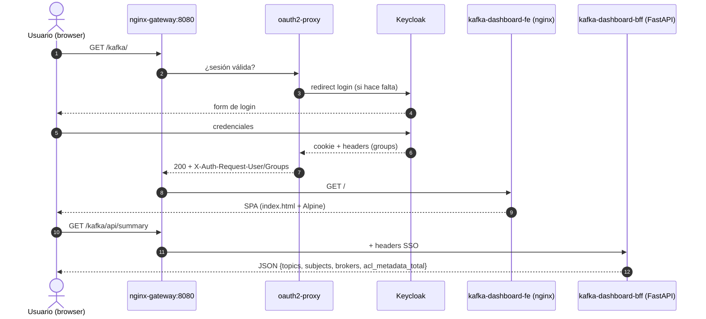
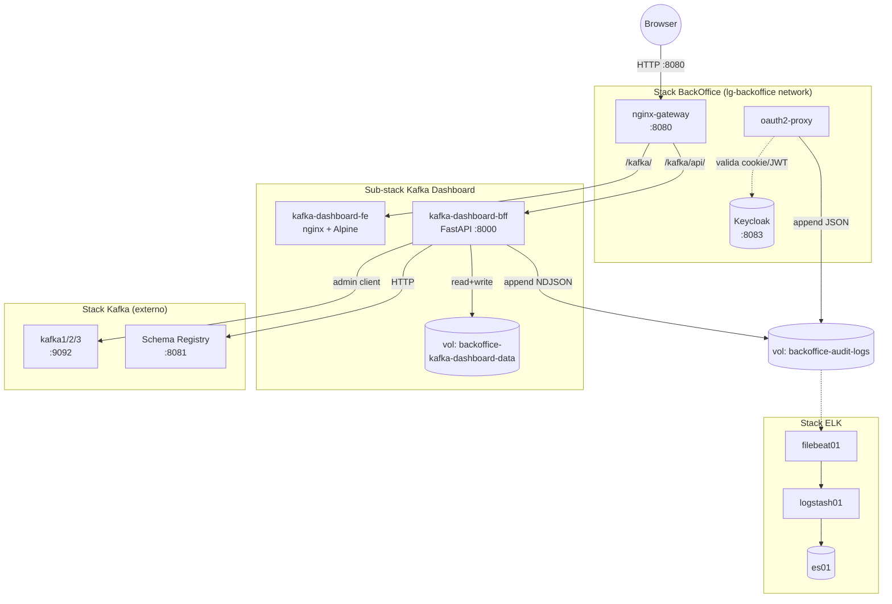

# Kafka Dashboard — Manual de uso

> 🇬🇧 **English version**: [user-guide.en.md](user-guide.en.md)

Microfrontend del BackOffice (`/kafka/`) para gestión declarativa de **topics**, **schemas** y **ACL-metadata** del cluster Kafka de `lg-labs`. Hereda SSO + roles del BackOffice y emite audit a `backoffice-audit-*`.

---

## Índice

- [Parte 1 — Manual de usuario](#parte-1--manual-de-usuario)
  - [1.1 ¿Qué es?](#11-qué-es)
  - [1.2 Roles y permisos](#12-roles-y-permisos)
  - [1.3 Primer acceso](#13-primer-acceso)
  - [1.4 Crear un topic](#14-crear-un-topic)
  - [1.5 Editar / borrar un topic](#15-editar--borrar-un-topic)
  - [1.6 Schemas (Schema Registry)](#16-schemas-schema-registry)
  - [1.7 ACL-metadata (anotaciones)](#17-acl-metadata-anotaciones)
  - [1.8 Export JSON](#18-export-json)
  - [1.9 Errores comunes](#19-errores-comunes)
- [Parte 2 — Manual del operador del stack](#parte-2--manual-del-operador-del-stack)
  - [2.1 Arquitectura del sub-stack](#21-arquitectura-del-sub-stack)
  - [2.2 Arranque y parada](#22-arranque-y-parada)
  - [2.3 Convención `lglabs.*` y owners](#23-convención-lglabs-y-owners)
  - [2.4 Audit en ELK + SQLite](#24-audit-en-elk--sqlite)
  - [2.5 Ficheros de configuración](#25-ficheros-de-configuración)
  - [2.6 Runbooks operativos](#26-runbooks-operativos)
  - [2.7 Limitaciones conocidas](#27-limitaciones-conocidas)
  - [2.8 Referencias](#28-referencias)

---

# Parte 1 — Manual de usuario

## 1.1 ¿Qué es?

Una UI web para que los equipos de `lg-labs` gestionen **topics**, **schemas** y **anotaciones de ACL** del cluster Kafka **sin tocar la CLI** ni necesitar permisos de admin sobre los brokers. Casos de uso:

- **Crear un topic** con la convención `lglabs.<dominio>.<entidad>` y un *owner* registrado.
- **Modificar configuración** de un topic existente (retención, compaction, particiones — sólo incrementar).
- **Registrar un schema** (Avro/Protobuf/JSON) en el Schema Registry y evolucionarlo respetando compatibilidad.
- **Anotar ACLs** que el cluster aún no aplica, como inventario para una migración futura.
- **Exportar** la definición JSON de un topic + sus schemas + sus ACL-metadata para snapshot / disaster recovery / reconciliación con IaC.

> ℹ️ Para producir/consumir mensajes use **AKHQ** (también dentro del BackOffice, en `/akhq/`). Este dashboard es **declarativo**, no transaccional.

## 1.2 Roles y permisos

Los 4 roles SSO del BackOffice (asignados en Keycloak) determinan qué puede hacer cada usuario:

| Rol | Topics | Schemas | ACL-metadata | Export | Comentario |
|---|---|---|---|---|---|
| `admin`    | CRUD | CRUD + set compatibility | **CRUD** | ✅ | Único que crea/edita/borra ACL-metadata |
| `operator` | CRUD | CRUD + set compatibility | leer | ✅ | Día a día de los topics |
| `support`  | leer | leer | leer | ❌ | Investigación / lectura forense |
| `viewer`   | leer | leer | leer | ❌ | Acceso de demo / formación |

> ⚠️ La autorización se aplica en **dos capas**: el `nginx-gateway` filtra por header `X-Auth-Request-Groups`, y el BFF redobla la comprobación con `require_admin` / `require_writer`. Una request sin grupo válido recibe **403** sin alcanzar la lógica de negocio.

## 1.3 Primer acceso

1. Abrir [http://localhost:8080/](http://localhost:8080/) en el navegador.
2. Login con uno de los usuarios seed:
   - `lglabsadmin` / `lglabsoperator` / `lglabssupport` / `lglabsviewer` — password `lgpass`.
3. En la home aparece la tarjeta **Kafka Dashboard** → click → llega a `/kafka/`.
4. La SPA carga, lee `whoami` y `summary` y muestra el resumen del cluster.



## 1.4 Crear un topic

1. Click en **Topics** → **Crear topic**.
2. **Nombre** — debe respetar `^lglabs\.[a-z0-9]([a-z0-9._-]*[a-z0-9])?$`. Ejemplo: `lglabs.payments.events`.
3. **Owner** — desplegable poblado desde `bff/config/owners.yaml`. Si tu equipo no aparece, abre PR contra ese fichero (no se puede crear desde la UI por diseño — los owners son catálogo controlado).
4. **Particiones** — entero positivo. Sólo se podrá **incrementar** después.
5. **Replication factor** — entero ≤ número de brokers. No se puede modificar después.
6. **Retención** (ms) y **cleanup.policy** — `delete` o `compact`.
7. **Crear** → 201 + redirect al detalle del topic.

> ⚠️ Los topics que empiezan por `__` o `_` son **internos** (Kafka, Schema Registry, etc.) y la API responde **403 `internal_topic_protected`** ante cualquier intento de modificación o borrado.

## 1.5 Editar / borrar un topic

- **Editar configuración**: en el detalle del topic, sección **Config** → modificar campos editables (retención, cleanup, segment.ms…) → **Guardar** (`PATCH`). Las particiones tienen su propio formulario que **sólo permite incrementar**.
- **Borrar**: botón rojo **Borrar topic** → modal pide **escribir el nombre exacto** del topic como confirmación. La API exige header `X-Confirm-Resource: <nombre>`; sin él, responde **409 `confirmation_required`**.
- **Owner**: editable in-line desde el detalle (admin/operator).

## 1.6 Schemas (Schema Registry)

- **Listado**: `Schemas` muestra subjects, sus versiones y nivel de compatibilidad actual.
- **Registrar nueva versión**: editor con el JSON del schema → **Validar** → si el Schema Registry lo rechaza por incompatibilidad, la UI muestra **el mismo mensaje que el Registry** (no se ofusca — design §A5).
- **Cambiar compatibility level**: `BACKWARD` / `FORWARD` / `FULL` / `NONE` (admin/operator).
- **Export schema**: descarga el subject completo con todas sus versiones (admin/operator).

> ℹ️ Los errores de compatibilidad llegan como `409 incompatible_schema` con el detalle exacto del Registry en `details.sr_message`.

## 1.7 ACL-metadata (anotaciones)

> ⚠️ **IMPORTANTE**: las ACL-metadata de este dashboard son **anotaciones informativas en SQLite**. El cluster Kafka **NO** las aplica como ACL reales. Sirven como inventario y como base para una futura migración a ACL reales (cuando el authorizer esté activo). Esto se muestra como un **banner permanente** en la pantalla.

- Listado filtrable por `principal`, `resource_name`, `resource_type`. Los 4 roles pueden leer.
- **Crear / editar / borrar** — sólo `admin`. UNIQUE constraint sobre `(principal, host, operation, resource_type, resource_name, pattern_type, permission_type)` → duplicado responde **409 `acl_metadata_duplicate`**.
- **Borrado** requiere escribir el `id` exacto en el modal de confirmación (igual que topics).
- Las anotaciones de cada topic se incluyen automáticamente en su **export JSON** (campo `acl_metadata_associated`).

## 1.8 Export JSON

Botón **Export** en el detalle de un topic (`admin`/`operator`). Descarga un JSON con:

```json
{
  "topic": { "name": "lglabs.payments.events", "owner": "...", "configs": {...}, "partitions": 12 },
  "schemas": [
    { "subject": "lglabs.payments.events-value", "versions": [...], "compatibility_level": "BACKWARD" }
  ],
  "acl_metadata_associated": [
    { "principal": "User:payments-svc", "operation": "WRITE", "resource_type": "TOPIC", ... }
  ]
}
```

Útil para snapshots, reconciliación con IaC, o handover a otro entorno.

## 1.9 Errores comunes

| Código HTTP | `error` | Mensaje en UI | Causa típica |
|---|---|---|---|
| 400 | `invalid_topic_name` | Nombre de topic inválido (debe empezar por `lglabs.`) | Convención §2.3 |
| 400 | `invalid_owner` | Owner no válido. Selecciona uno del catálogo. | Owner no está en `owners.yaml` |
| 400 | `invalid_partitions` | Número de particiones inválido. Solo se pueden incrementar. | Decremento de particiones |
| 400 | `invalid_principal` | El principal debe empezar por `User:` o `Group:`. | Validación ACL-metadata |
| 403 | `internal_topic_protected` | Los topics internos (prefijo `__` o `_`) no se pueden modificar. | Operación sobre `__consumer_offsets` etc. |
| 403 | `forbidden` | No tienes permisos para esta acción. | Rol insuficiente (gateway o BFF) |
| 404 | `topic_not_found` | El topic no existe. | Borrado fuera de banda |
| 409 | `topic_already_exists` | Ya existe un topic con ese nombre. | POST duplicado |
| 409 | `incompatible_schema` | El schema es incompatible con el nivel de compatibilidad configurado. | Evolución que rompe BACKWARD/FORWARD |
| 409 | `acl_metadata_duplicate` | Ya existe una entrada idéntica. | UNIQUE constraint |
| 409 | `confirmation_required` | Falta confirmación. Escribe el nombre exacto del recurso. | Header `X-Confirm-Resource` ausente o erróneo |
| 422 | `validation_error` | Datos inválidos en el formulario. | Pydantic field validators |
| 503 | `kafka_unavailable` | El cluster de Kafka no responde. | Brokers caídos / red |
| 503 | `registry_unavailable` | El Schema Registry no responde. | SR caído |
| 500 | `internal_error` | Error interno del servidor. | Excepción no controlada (ver logs BFF) |

---

# Parte 2 — Manual del operador del stack

## 2.1 Arquitectura del sub-stack



**Puntos clave**:

- El BFF está en **dos redes**: `lg-backoffice` (gateway↔BFF) y `lg-infra-kafka_default` (BFF↔Kafka brokers + Schema Registry). No expone puerto al host.
- El frontend es **estático** servido por nginx. No tiene build step — sólo HTML + Alpine.js + Tailwind (todo vendored).
- La persistencia local es **SQLite** en volumen named (sobrevive a `down/up`, se borra con `clean`).
- El audit log llega a ELK vía un **volumen compartido** (`backoffice-audit-logs`) — el mismo modelo que oauth2-proxy.

## 2.2 Arranque y parada

El sub-stack del Kafka Dashboard se levanta automáticamente cuando se levanta el BackOffice (está incluido vía `include:` en `backoffice/docker-compose.yml`):

```bash
# Pre-requisitos
make elk-up
make kafka-up

# Levanta backoffice + kafka-dashboard juntos
make backoffice-up
```

URL: [http://localhost:8080/kafka/](http://localhost:8080/kafka/) (login SSO).

```bash
# Parar (mantiene volúmenes)
make backoffice-down

# Destruir (incluye `backoffice-kafka-dashboard-data`)
make backoffice-clean
```

> ℹ️ **No hay `make kafka-dashboard-up` separado**: el sub-stack se compone con el BackOffice por diseño. Para reconstruir sólo el BFF tras un cambio de código:
>
> ```bash
> docker compose -f backoffice/docker-compose.yml build kafka-dashboard-bff
> docker compose -f backoffice/docker-compose.yml up -d kafka-dashboard-bff
> ```

## 2.3 Convención `lglabs.*` y owners

**Regex de topic name** (impuesto por el BFF, validación 400 `invalid_topic_name`):

```
^lglabs\.[a-z0-9]([a-z0-9._-]*[a-z0-9])?$
```

**Owners** se cargan al arranque desde `backoffice/dashboards/kafka-dashboard/bff/config/owners.yaml`:

```yaml
owners:
  - id: payments
    name: Payments Team
    email: payments@lglabs.local
  - id: catalog
    name: Catalog Team
    email: catalog@lglabs.local
  ...
```

Cualquier topic creado debe referenciar un `id` existente en este YAML. **Cambio de catálogo = PR + reinicio del BFF** (carga sólo en `lifespan`).

## 2.4 Audit en ELK + SQLite

Cada request mutante (no-GET y no `/api/health`) deja huella en **tres sinks**:

```mermaid
flowchart LR
    BFF[FastAPI middleware] --> STDOUT[stdout JSON]
    BFF --> FILE[/var/log/backoffice/<br/>kafka-dashboard-app.log]
    BFF --> SQLITE[(audit_log table<br/>SQLite)]
    FILE -->|tail| FB[filebeat01]
    FB -->|tag=kafka-dashboard-app| LS[logstash01]
    LS --> ES[(backoffice-audit-*<br/>ES index)]
```

**Campos del evento** (NDJSON line):

```json
{
  "audit_source": "kafka-dashboard-bff",
  "audit_type":   "request",
  "user":         "lglabsoperator@lglabs.local",
  "groups":       ["operator"],
  "method":       "POST",
  "path":         "/api/topics",
  "original_uri": "/kafka/api/topics",
  "status":       201,
  "duration_ms":  42,
  "request_id":   "<uuid>"
}
```

**Buscar en Kibana**: data view `backoffice-audit-*` → filtrar `audit_source: "kafka-dashboard-bff"`.

```bash
# Ejemplo: docs en ES
curl -sk -u elastic:lgpass \
  "https://localhost:9200/backoffice-audit-*/_search?q=audit_source:kafka-dashboard-bff" \
  | jq '.hits.hits[0]._source'
```

> ✅ **Limitación L2 mitigada**: a diferencia de oauth2-proxy (que sólo ve `/oauth2/auth` en sus logs), el BFF emite la **URI original del gateway** en `original_uri`. Esto da trazabilidad completa de la acción del usuario sin parsear logs del proxy.

## 2.5 Ficheros de configuración

| Fichero | Propósito | Cambio en caliente |
|---|---|---|
| `backoffice/dashboards/kafka-dashboard/bff/config/owners.yaml` | Catálogo de equipos elegibles como `owner` de topics | ❌ requiere reinicio del BFF |
| `backoffice/dashboards/kafka-dashboard/docker-compose.yml` | Servicios FE/BFF, volúmenes, redes | ❌ requiere `up -d` |
| `backoffice/home/nginx.conf` | Routing del gateway hacia `/kafka/` y `/kafka/api/` + RBAC | ✅ `nginx -s reload` en el container `gateway` |
| `backoffice/dashboards/kafka-dashboard/frontend/index.html` + `assets/*` | SPA estática | ✅ bind-mounted, refresh del navegador (más `nginx -s reload` si se cachea) |
| `backoffice/dashboards/kafka-dashboard/bff/app/repos/migrations/*.sql` | Migraciones SQLite (idempotentes vía `_schema_version`) | ❌ se aplican en el `lifespan` del BFF |
| `elk/filebeat.yml` | Inputs de filebeat (incluye `kafka-dashboard-app`) | ❌ requiere `docker restart filebeat01` |
| `elk/logstash.conf` | Routing de tags a índices ES | ❌ requiere `docker restart logstash01` |

## 2.6 Runbooks operativos

### R1. Kafka cluster no responde

**Síntoma**: API responde `503 kafka_unavailable`. UI muestra banner de error.

```bash
# Diagnóstico
docker ps --format '{{.Names}}\t{{.Status}}' | grep kafka
docker logs lg-infra-kafka-kafka1-1 --tail 50

# Recuperación
make kafka-up      # si está caído
docker restart lg-infra-backoffice-kafka-dashboard-bff   # forzar reconexión del admin client
```

### R2. Schema Registry no responde

**Síntoma**: endpoints `/api/schemas/*` devuelven `503 registry_unavailable`. CRUD de topics sigue funcionando.

```bash
docker ps | grep schema-registry
docker logs lg-infra-kafka-schema-registry-1 --tail 50
docker restart lg-infra-kafka-schema-registry-1
```

### R3. SQLite corrupto / migración fallida

**Síntoma**: BFF no arranca; logs muestran `OperationalError` o `migration X failed`.

```bash
# Ver versión aplicada
docker exec lg-infra-backoffice-kafka-dashboard-bff python -c \
  "import sqlite3; c=sqlite3.connect('/data/kafka-dashboard.sqlite'); \
   print(c.execute('SELECT version FROM _schema_version').fetchall())"

# Backup + restore desde el último snapshot (ver R5)
docker run --rm -v backoffice-kafka-dashboard-data:/data alpine \
  cp /data/kafka-dashboard.sqlite /data/kafka-dashboard.sqlite.broken

# Si no hay backup útil: empezar desde cero (PIERDE owners/ACL-metadata/audit_log)
make backoffice-down
docker volume rm backoffice-kafka-dashboard-data
make backoffice-up
```

### R4. `owners.yaml` malformado

**Síntoma**: BFF arranca pero log dice `owners loaded count=0`; toda creación de topic falla con `invalid_owner`.

```bash
# Validar YAML
docker exec lg-infra-backoffice-kafka-dashboard-bff python -c \
  "import yaml; print(yaml.safe_load(open('/app/config/owners.yaml')))"

# Corregir y reiniciar
$EDITOR backoffice/dashboards/kafka-dashboard/bff/config/owners.yaml
docker restart lg-infra-backoffice-kafka-dashboard-bff
```

### R5. Backup / restore manual del volumen SQLite

No existe target de Makefile para esto (decisión registrada en `tasks.md` G.4). Pattern manual:

```bash
# Backup
TS=$(date +%Y%m%d-%H%M%S)
docker run --rm \
  -v backoffice-kafka-dashboard-data:/data \
  -v "$PWD":/backup \
  alpine tar czf "/backup/kafka-dashboard-$TS.tgz" -C /data .

# Restore
make backoffice-down
docker run --rm \
  -v backoffice-kafka-dashboard-data:/data \
  -v "$PWD":/backup \
  alpine sh -c "rm -rf /data/* && tar xzf /backup/kafka-dashboard-$TS.tgz -C /data"
make backoffice-up
```

## 2.7 Limitaciones conocidas

| # | Limitación | Impacto | Tracked en |
|---|---|---|---|
| L1 | ACL-metadata no se aplican al cluster (sólo SQLite) | El usuario debe entender la diferencia entre "anotar" y "enforcer" | design §A6, banner permanente en UI, backlog B1 |
| L2 | _Resuelta para Kafka Dashboard_ — el BFF emite la URI original del gateway en `original_uri` | Audit en ELK trazable sin parsear logs del proxy | resolución en Fase F (commit 0056d3f) |
| L3 | Particiones sólo se pueden incrementar | Limitación de Kafka, no del dashboard | design §3.2 |
| L4 | Los owners no se gestionan desde la UI | Requiere PR contra `owners.yaml` | decisión §requirements US-1, backlog futuro |
| L5 | No hay producir/consumir mensajes | Delegado a AKHQ (`/akhq/`) | scope explícito del MVP |

## 2.8 Referencias

- **Specs SDD**: `backoffice/dashboards/kafka-dashboard/specs/{requirements,design,tasks,smoke-tests}.md`
- **Constitution addendum**: `backoffice/dashboards/kafka-dashboard/specs/CONSTITUTION-addendum.md`
- **BackOffice user guide**: [`backoffice/docs/user-guide.es.md`](../../../docs/user-guide.es.md)
- **Smoke scripts**: `backoffice/dashboards/kafka-dashboard/bff/tests/scripts/smoke-{b7,c,f}.sh`
- **AKHQ** (producir/consumir): `/akhq/` dentro del BackOffice
- **Kibana data view audit**: `backoffice-audit-*` → filtro `audit_source: "kafka-dashboard-bff"`
