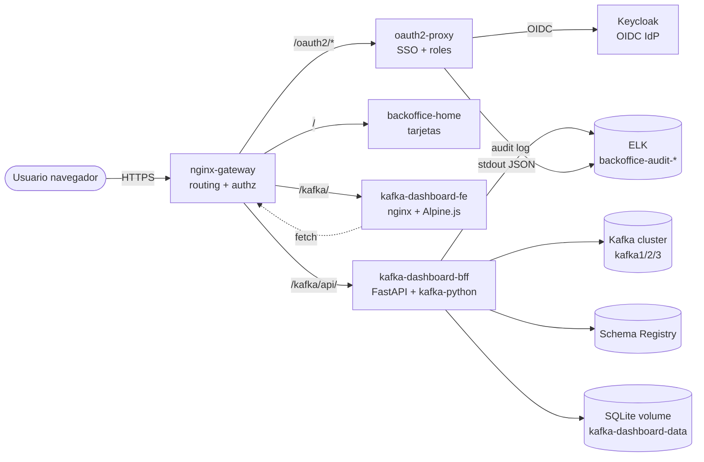
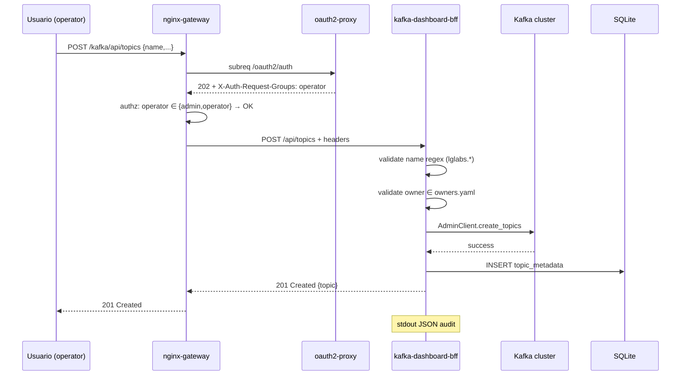

# Kafka Dashboard — Design

> Versión: 0.2.0 · Estado: Reflects implementation · Última actualización: 2026-05-10
>
> Este documento define **cómo** se construye el Kafka Dashboard. El **qué** está en `requirements.md`. Las decisiones inmutables están en `CONSTITUTION-addendum.md` (que hereda `backoffice/CONSTITUTION.md`).
>
> Cada sección de diseño debe ser verificable: o se mapea a código/config, o se mapea a un test en `smoke-tests.md`.

---

## 1. Arquitectura

### 1.1. Posición en el ecosistema



### 1.2. Flujo de una request mutadora (crear topic)



### 1.3. Decisiones arquitectónicas clave

| ID | Decisión | Razón |
|---|---|---|
| AD-1 | **Frontend separado del BFF** (dos contenedores) | nginx ya está como base estable; BFF puede reiniciarse sin tirar la UI estática |
| AD-2 | **BFF con FastAPI** (no Flask, no Django) | OpenAPI gratis para validar contratos; pydantic ya valida lo del frontend |
| AD-3 | **kafka-python**, no confluent-kafka-python | Pure Python, sin librdkafka como dependencia nativa; suficiente para AdminClient |
| AD-4 | **SQLite local en volumen**, no Postgres compartido | §A2: estado mínimo, sin acoplar dos stacks |
| AD-5 | **owners.yaml montado read-only** desde repo | §7.2 requirements: cambios via PR, no via UI |
| AD-6 | **Authz en nginx**, no en BFF | Coherente con el resto del BackOffice; el BFF asume "si llegó, está autorizado" |
| AD-7 | **Audit doble**: oauth2-proxy (tags=auth) + BFF (tags=app) | §A8: cubre L2 del BackOffice (path real, no `/oauth2/auth`) |

---

## 2. Componentes

### 2.1. Mapa de servicios docker-compose

| Servicio | Imagen | Puerto host | Networks | Volumes |
|---|---|---|---|---|
| `kafka-dashboard-fe` | `nginx:1.27-alpine` | — (interno) | `lg-backoffice` | `./frontend:/usr/share/nginx/html:ro` |
| `kafka-dashboard-bff` | build local (Dockerfile) | — (interno) | `lg-backoffice` + `lg-infra-kafka_default` | `backoffice-kafka-dashboard-data:/data`, `./bff/config:/app/config:ro` |

> **Nota cross-stack**: el BFF necesita la red `lg-infra-kafka_default` (externa) para resolver `kafka1:9092`. Esto es la única excepción al principio §6 del BackOffice (separación de stacks) — documentada explícitamente como AD-cross-1. La red ya está declarada como `external: true` en `backoffice/docker-compose.yml` (la usa AKHQ vía gateway).
>
> Nombres reales de containers: `lg-infra-backoffice-kafka-dashboard-fe` y `lg-infra-backoffice-kafka-dashboard-bff` (siguiendo convención del BackOffice).

### 2.2. Frontend (`kafka-dashboard-fe`)

- **Stack**: HTML estático + Alpine.js 3.x (CDN o vendored) + Tailwind via CDN (no build).
- **Ruta servida**: el gateway proxea `/kafka/` → `kafka-dashboard-fe:80/`. La UI usa rutas relativas (`./api/topics` resuelve a `/kafka/api/topics`).
- **Estructura `frontend/`**:
  ```
  frontend/
  ├── index.html           # home con summary
  ├── topics.html          # listado + creación
  ├── topic-detail.html    # detalle + edit + delete
  ├── schemas.html         # listado de subjects
  ├── schema-detail.html   # versiones de un subject
  ├── acl-metadata.html    # CRUD ACL-metadata
  ├── assets/
  │   ├── alpine.min.js    # vendored, 3.x
  │   ├── tailwind.min.css # vendored
  │   └── app.js           # helpers compartidos (fetch wrapper, error display)
  └── nginx.conf           # solo expone /, no proxy
  ```
- **Sin SPA router**: cada vista es una página HTML independiente. Esto evita state management y simplifica el F5/recargas.

### 2.3. BFF (`kafka-dashboard-bff`)

- **Stack**: Python 3.12 + FastAPI 0.115 + kafka-python 2.0 + httpx (Schema Registry) + sqlmodel (SQLite ORM ligero) + pydantic 2.
- **Estructura `bff/`**:
  ```
  bff/
  ├── Dockerfile
  ├── requirements.txt
  ├── pyproject.toml
  ├── app/
  │   ├── main.py              # FastAPI factory
  │   ├── deps.py              # auth deps (extrae headers oauth2-proxy)
  │   ├── settings.py          # pydantic-settings (env vars)
  │   ├── owners.py            # carga + valida owners.yaml
  │   ├── audit.py             # logger JSON estructurado
  │   ├── errors.py            # excepciones + handlers
  │   ├── routers/
  │   │   ├── health.py
  │   │   ├── topics.py
  │   │   ├── schemas.py
  │   │   ├── acl_metadata.py
  │   │   ├── summary.py
  │   │   └── export.py
  │   ├── repos/
  │   │   ├── kafka_repo.py        # AdminClient wrapper
  │   │   ├── registry_repo.py     # Schema Registry HTTP client
  │   │   ├── topic_metadata_repo.py  # SQLite
  │   │   └── acl_metadata_repo.py    # SQLite
  │   └── models/
  │       ├── domain.py        # pydantic domain models
  │       └── db.py            # sqlmodel tables
  ├── config/
  │   └── owners.yaml          # mounted ro
  └── tests/
      ├── unit/
      └── contract/
  ```
- **Endpoint base**: el BFF se monta en `/api` internamente (sin prefix `/kafka/`); el gateway añade `/kafka/api/` → `bff:8000/api/`.

### 2.4. Persistencia (`kafka-dashboard-data` volume)

- Volumen Docker named, NO bind mount.
- Contiene un único archivo `app.db` (SQLite).
- Backup: `make kafka-dashboard-backup` → `tar` del volumen a `./backups/kafka-dashboard-YYYYMMDD.tgz` (idempotente).
- Restore: `make kafka-dashboard-restore FILE=...` (requiere stop del BFF).

---

## 3. Contratos API

> Todos los endpoints viven bajo `/kafka/api/` desde fuera, `/api/` dentro del BFF. Todos devuelven JSON. Todos honran `Accept: application/json`. Errores siguen el envelope §7.

### 3.1. Health

#### `GET /api/health`

| Campo | Detalle |
|---|---|
| Auth | público (no pasa por oauth2-proxy auth_request) |
| Roles | n/a |
| Request | — |
| Response 200 | `{"status":"ok","kafka":"ok\|degraded","registry":"ok\|degraded","sqlite":"ok"}` |
| Response 503 | mismo schema con `status:"degraded"` si todo está caído |

> Usado por el healthcheck de docker-compose. Nginx lo expone en `/kafka/api/health` con `auth_request off`.

### 3.2. Summary (US-8)

#### `GET /api/summary`

| Campo | Detalle |
|---|---|
| Auth | requerido (todos los roles) |
| Response 200 | `{brokers_alive: int, topics_total: int, topics_internal_hidden: int, schemas_total: int, acl_metadata_total: int, components: {kafka:"ok\|degraded", registry:"ok\|degraded", sqlite:"ok"}}` |

### 3.3. Topics (US-1..4, C-T)

#### `GET /api/topics`

| Campo | Detalle |
|---|---|
| Auth | requerido (todos los roles) |
| Query | `?include_internal=false&search=&page=1&page_size=50` |
| Response 200 | `{items: TopicSummary[], total: int, page: int, page_size: int}` |

`TopicSummary`:
```json
{
  "name": "lglabs.orders.created",
  "partitions": 6,
  "replication_factor": 3,
  "min_insync_replicas": 2,
  "cleanup_policy": "delete",
  "retention_ms": 604800000,
  "is_internal": false,
  "description": "Orders created by checkout (nullable)",
  "owner": "team-payments"
}
```

#### `GET /api/topics/{name}`

| Campo | Detalle |
|---|---|
| Auth | requerido (todos los roles) |
| Response 200 | `TopicDetail` (configs completos + partitions detail + metadatos SQLite) |
| Response 404 | si no existe en cluster |

`TopicDetail` extiende `TopicSummary` con:
```json
{
  "configs": { "<key>": "<value>" },
  "partitions": [{"id": 0, "leader": 1, "replicas": [1,2,3], "isr": [1,2,3]}, ...],
  "created_at": "2026-05-10T12:00:00Z",
  "created_by": "lglabsoperator@lglabs.local",
  "updated_at": "...",
  "updated_by": "..."
}
```

#### `POST /api/topics`

| Campo | Detalle |
|---|---|
| Auth | admin, operator |
| Request | `CreateTopicReq` |
| Response 201 | `TopicDetail` |
| Response 400 | `invalid_topic_name`, `invalid_owner`, `invalid_partitions`, `invalid_rf` |
| Response 409 | `topic_already_exists` |

`CreateTopicReq`:
```json
{
  "name": "lglabs.orders.created",
  "partitions": 6,
  "replication_factor": 3,
  "cleanup_policy": "delete",
  "retention_ms": 604800000,
  "min_insync_replicas": 2,
  "description": "Orders created by checkout",
  "owner": "team-payments"
}
```

Validaciones server-side:
- `name`: regex `^lglabs\.[a-z0-9]([a-z0-9._-]*[a-z0-9])?$`, len ≤ 249.
- `partitions`: 1..100.
- `replication_factor`: 1..3, ≤ brokers vivos.
- `cleanup_policy`: enum `delete|compact|both`.
- `retention_ms`: 60000..31536000000 (1m..1y).
- `min_insync_replicas`: 1..`replication_factor`.
- `description`: ≥ 10 chars.
- `owner`: existe en `owners.yaml`.

#### `PATCH /api/topics/{name}`

| Campo | Detalle |
|---|---|
| Auth | admin, operator |
| Request | `UpdateTopicReq` (partial — solo campos editables) |
| Response 200 | `TopicDetail` |
| Response 404 | topic no existe |

Editables: `partitions` (sólo aumento), `cleanup_policy`, `retention_ms`, `min_insync_replicas`, `description`, `owner`.
**No** editable: `name`, `replication_factor` (US-3 AC-3.3).

#### `DELETE /api/topics/{name}`

| Campo | Detalle |
|---|---|
| Auth | admin, operator |
| Headers | `X-Confirm-Resource: <name>` (debe coincidir EXACTAMENTE con el path) |
| Response 204 | éxito |
| Response 403 | `internal_topic_protected` (si name empieza por `__` o `_`) |
| Response 404 | topic no existe |
| Response 409 | `confirmation_required` (header ausente o no coincide) |

#### `GET /api/topics/{name}/export`

| Campo | Detalle |
|---|---|
| Auth | admin, operator |
| Response 200 | JSON con `topic` + `acl_metadata_associated` + `schemas_associated` (subjects que matchean por convención `<topic>-key`, `<topic>-value`) |
| Headers | `Content-Disposition: attachment; filename="<name>.json"` |

### 3.4. Schemas (US-5, US-6, C-S)

> El BFF actúa como proxy con validación contra Schema Registry (SR). No cachea. No reescribe.

#### `GET /api/schemas`

Lista subjects con su última versión y compatibility level.

`Response 200`: `{items: [{subject, latest_version, compatibility_level, schema_type}]}`.

#### `GET /api/schemas/{subject}`

Lista todas las versiones del subject.

`Response 200`: `{subject, compatibility_level, versions: [{id, version, schema_type, schema}]}`.

#### `GET /api/schemas/{subject}/versions/{version}`

Devuelve una versión específica + diff con la anterior.

`Response 200`: `{version, schema, diff_with_previous: string|null}`.

#### `POST /api/schemas/{subject}/versions`

| Auth | admin, operator |
|---|---|
| Request | `{schema: string, schema_type: "AVRO\|JSON\|PROTOBUF", references?: []}` |
| Response 200 | `{id, version}` (proxy del SR) |
| Response 409 | `incompatible_schema` (re-emitido tal cual desde SR — §A5) |

#### `PUT /api/schemas/{subject}/config`

| Auth | admin, operator |
|---|---|
| Request | `{compatibility_level: "BACKWARD\|FORWARD\|FULL\|NONE\|...\"}` |
| Response 200 | `{compatibility_level}` |

#### `GET /api/schemas/{subject}/export`

Igual que topic export pero para schema (todas las versiones).

### 3.5. ACL-metadata (US-7, C-A)

> Todas estas rutas operan sobre SQLite. El cluster Kafka **no** las aplica. La UI muestra banner permanente (§A6).

#### `GET /api/acl-metadata`

| Auth | requerido (todos los roles) |
|---|---|
| Query | `?principal=&resource_name=&resource_type=&page=&page_size=` |
| Response 200 | `{items: AclMetadata[], total, page, page_size}` |

#### `POST /api/acl-metadata`

| Auth | **admin** (operator NO) |
|---|---|
| Request | `AclMetadataCreateReq` |
| Response 201 | `AclMetadata` |
| Response 400 | `invalid_principal`, `invalid_resource_pattern` |
| Response 409 | `acl_metadata_duplicate` (combinación principal+resource+operation+permission_type ya existe) |

`AclMetadata`:
```json
{
  "id": "uuid",
  "principal": "User:team-payments",
  "host": "*",
  "operation": "READ",
  "resource_type": "TOPIC",
  "resource_name": "lglabs.orders.",
  "pattern_type": "PREFIXED",
  "permission_type": "ALLOW",
  "note": "Free text",
  "created_by": "lglabsadmin@lglabs.local",
  "created_at": "2026-05-10T12:00:00Z"
}
```

#### `PUT /api/acl-metadata/{id}`

Idem POST. Sólo admin.

#### `DELETE /api/acl-metadata/{id}`

Sólo admin. Header `X-Confirm-Resource: <id>` (mismo patrón §A4).

---

## 4. Modelo SQLite

### 4.1. DDL

```sql
-- Migrations gestionadas con un script idempotente (no Alembic en MVP).
-- Esquema versionado con tabla `_schema_version`.

CREATE TABLE IF NOT EXISTS _schema_version (
    version INTEGER PRIMARY KEY,
    applied_at TEXT NOT NULL DEFAULT (datetime('now'))
);

CREATE TABLE IF NOT EXISTS topic_metadata (
    name        TEXT PRIMARY KEY,
    description TEXT NOT NULL,
    owner       TEXT NOT NULL,
    created_at  TEXT NOT NULL DEFAULT (datetime('now')),
    created_by  TEXT NOT NULL,
    updated_at  TEXT NOT NULL DEFAULT (datetime('now')),
    updated_by  TEXT NOT NULL
);

CREATE INDEX IF NOT EXISTS idx_topic_metadata_owner ON topic_metadata(owner);

CREATE TABLE IF NOT EXISTS acl_metadata (
    id              TEXT PRIMARY KEY,           -- uuid v4
    principal       TEXT NOT NULL,
    host            TEXT NOT NULL DEFAULT '*',
    operation       TEXT NOT NULL,              -- READ|WRITE|CREATE|DELETE|ALTER|DESCRIBE|ALL
    resource_type   TEXT NOT NULL,              -- TOPIC|GROUP|CLUSTER
    resource_name   TEXT NOT NULL,
    pattern_type    TEXT NOT NULL,              -- LITERAL|PREFIXED
    permission_type TEXT NOT NULL,              -- ALLOW|DENY
    note            TEXT,
    created_at      TEXT NOT NULL DEFAULT (datetime('now')),
    created_by      TEXT NOT NULL,
    UNIQUE (principal, host, operation, resource_type, resource_name, pattern_type, permission_type)
);

CREATE INDEX IF NOT EXISTS idx_acl_principal     ON acl_metadata(principal);
CREATE INDEX IF NOT EXISTS idx_acl_resource_name ON acl_metadata(resource_name);

CREATE TABLE IF NOT EXISTS audit_log (
    id          INTEGER PRIMARY KEY AUTOINCREMENT,
    ts          TEXT NOT NULL DEFAULT (datetime('now')),
    user        TEXT NOT NULL,
    groups      TEXT,            -- comma-joined
    method      TEXT NOT NULL,
    path        TEXT NOT NULL,   -- URI ORIGINAL del cliente (cubre L2)
    status      INTEGER NOT NULL,
    resource    TEXT,            -- topic name / subject / acl id
    detail      TEXT             -- JSON serializado opcional
);

CREATE INDEX IF NOT EXISTS idx_audit_ts   ON audit_log(ts);
CREATE INDEX IF NOT EXISTS idx_audit_user ON audit_log(user);
```

### 4.2. Reglas de consistencia

- El **cluster Kafka es la fuente de verdad** para topics. SQLite solo enriquece. Si un topic existe en Kafka pero no en SQLite (creado por AKHQ o CLI), aparece en la lista con `description=null, owner=null` y un badge "no managed".
- Si un topic existe en SQLite pero no en Kafka (borrado out-of-band), el BFF lo limpia perezosamente al listarlo (`DELETE FROM topic_metadata WHERE name=?`) y loguea WARN.
- ACL-metadata **es** la fuente de verdad (no hay nada externo). Si SQLite se pierde, se pierde la info. Backup recomendado en `Makefile`.

### 4.3. Migraciones

- Cada arranque del BFF ejecuta `migrations/00x_*.sql` ordenadas, registrando cada una en `_schema_version`.
- En MVP solo hay `001_initial.sql` con el DDL anterior.

---

## 5. Integración con el gateway

### 5.1. Bloques nginx nuevos en `backoffice/home/nginx.conf`

```nginx
# Frontend estático del Kafka Dashboard
location /kafka/ {
    auth_request /oauth2/auth;
    error_page 401 = @redirect_to_login;
    auth_request_set $auth_user   $upstream_http_x_auth_request_user;
    auth_request_set $auth_groups $upstream_http_x_auth_request_groups;

    # Cualquier rol autenticado puede acceder a la UI
    proxy_set_header Host              $http_host;
    proxy_set_header X-Real-IP         $remote_addr;
    proxy_set_header X-Forwarded-For   $proxy_add_x_forwarded_for;
    proxy_set_header X-Forwarded-Proto $scheme;
    proxy_set_header X-Auth-Request-User   $auth_user;
    proxy_set_header X-Auth-Request-Groups $auth_groups;

    proxy_pass http://kafka-dashboard-fe/;
}

# API del BFF — authz por método/path
location /kafka/api/ {
    auth_request /oauth2/auth;
    error_page 401 = @redirect_to_login;
    auth_request_set $auth_user   $upstream_http_x_auth_request_user;
    auth_request_set $auth_groups $upstream_http_x_auth_request_groups;

    # GETs: cualquier rol autenticado.
    # Mutaciones: depende del path (ver §6).
    set $authz_ok 0;
    if ($request_method = GET)  { set $authz_ok 1; }
    if ($request_method = HEAD) { set $authz_ok 1; }

    # admin u operator pueden mutar topics y schemas
    if ($auth_groups ~ "(^|,)(admin|operator)(,|$)") { set $authz_ok "${authz_ok}_writer"; }
    # solo admin puede mutar acl-metadata
    if ($auth_groups ~ "(^|,)admin(,|$)")            { set $authz_ok "${authz_ok}_admin"; }

    set $is_acl_mutation 0;
    if ($uri ~ "^/kafka/api/acl-metadata") { set $is_acl_mutation 1; }
    if ($request_method = GET)             { set $is_acl_mutation 0; }
    if ($request_method = HEAD)            { set $is_acl_mutation 0; }

    # Reglas finales
    if ($authz_ok = 0)                                 { return 403; }
    if ($is_acl_mutation$authz_ok ~ "^1.*_admin$")     { set $authz_ok pass; }
    if ($is_acl_mutation$authz_ok ~ "^1.*_writer$")    { return 403; } # writer no es admin
    if ($authz_ok ~ "_writer|_admin|^1$")              { set $authz_ok pass; }
    if ($authz_ok != pass)                              { return 403; }

    # Health pasa sin auth (override)
    location = /kafka/api/health {
        auth_request off;
        proxy_pass http://kafka-dashboard-bff:8000/api/health;
    }

    proxy_set_header Host              $http_host;
    proxy_set_header X-Real-IP         $remote_addr;
    proxy_set_header X-Forwarded-For   $proxy_add_x_forwarded_for;
    proxy_set_header X-Forwarded-Proto $scheme;
    proxy_set_header X-Auth-Request-User   $auth_user;
    proxy_set_header X-Auth-Request-Groups $auth_groups;
    proxy_set_header X-Original-URI        $request_uri;

    proxy_pass http://kafka-dashboard-bff:8000/api/;
}
```

> **Nota de implementación**: el `if` de nginx es notoriamente frágil. La versión final en código probablemente migre a un `map` + `try_files`/`@named_locations` siguiendo el patrón del BackOffice (§13.3 design BackOffice). Esta sección documenta la **intención**; `tasks.md` Fase B obliga a refactorizar a `map` antes de cerrar la fase.

### 5.2. Tarjeta en home

`backoffice/home/index.html` añade:

```html
<a href="/kafka/" class="card" data-roles="admin,operator,support,viewer">
  <h3>Kafka Dashboard</h3>
  <p>Gestión de topics, schemas y ACL-metadata.</p>
  <small>Cluster lg-labs · 3 brokers · Schema Registry</small>
</a>
```

> Visible para los 4 roles. La autorización fina (qué se puede mutar) la decide el BFF/gateway, no la home.

---

## 6. Matriz role × endpoint

| Endpoint | Method | admin | operator | support | viewer |
|---|---|:-:|:-:|:-:|:-:|
| `/api/health` | GET | ✅ | ✅ | ✅ | ✅ (sin auth) |
| `/api/summary` | GET | ✅ | ✅ | ✅ | ✅ |
| `/api/topics` | GET | ✅ | ✅ | ✅ | ✅ |
| `/api/topics` | POST | ✅ | ✅ | ❌ | ❌ |
| `/api/topics/{n}` | GET | ✅ | ✅ | ✅ | ✅ |
| `/api/topics/{n}` | PATCH | ✅ | ✅ | ❌ | ❌ |
| `/api/topics/{n}` | DELETE | ✅ | ✅ | ❌ | ❌ |
| `/api/topics/{n}/export` | GET | ✅ | ✅ | ❌ | ❌ |
| `/api/schemas...` | GET | ✅ | ✅ | ✅ | ✅ |
| `/api/schemas/{s}/versions` | POST | ✅ | ✅ | ❌ | ❌ |
| `/api/schemas/{s}/config` | PUT | ✅ | ✅ | ❌ | ❌ |
| `/api/acl-metadata` | GET | ✅ | ✅ | ✅ | ✅ |
| `/api/acl-metadata` | POST | ✅ | ❌ | ❌ | ❌ |
| `/api/acl-metadata/{id}` | PUT/DELETE | ✅ | ❌ | ❌ | ❌ |

> Esta tabla es el **contrato verificable**: `smoke-tests.md` ejecutará una request por cada celda con un usuario de cada rol y verificará el status esperado.

---

## 7. Manejo de errores

### 7.1. Error envelope

Todos los errores (4xx, 5xx) responden con:

```json
{
  "error": "<machine_code>",
  "message": "<human-readable, en inglés>",
  "details": { /* opcional, contexto */ }
}
```

- `error` es **estable** y **enumerable** — la UI puede mapear códigos a mensajes localizados.
- `message` es para developers, no para el usuario final.
- `details` puede contener `field`, `constraint`, `value` (sin secretos).

### 7.2. Códigos de error definidos

| Code | HTTP | Origen |
|---|---|---|
| `invalid_topic_name` | 400 | regex no cumple |
| `invalid_owner` | 400 | owner no está en YAML |
| `invalid_partitions` | 400 | fuera de rango |
| `invalid_rf` | 400 | rf > brokers |
| `invalid_payload` | 400 | pydantic validation |
| `invalid_principal` | 400 | ACL malformada |
| `invalid_resource_pattern` | 400 | ACL malformada |
| `internal_topic_protected` | 403 | nombre interno |
| `topic_not_found` | 404 | — |
| `subject_not_found` | 404 | — |
| `acl_metadata_not_found` | 404 | — |
| `topic_already_exists` | 409 | colisión |
| `acl_metadata_duplicate` | 409 | UNIQUE constraint |
| `confirmation_required` | 409 | header ausente/no coincide |
| `incompatible_schema` | 409 | re-emitido del SR |
| `kafka_unavailable` | 503 | brokers no responden |
| `registry_unavailable` | 503 | SR no responde |

### 7.3. Mapeo Kafka exceptions

| kafka-python exception | HTTP | error code |
|---|---|---|
| `TopicAlreadyExistsError` | 409 | `topic_already_exists` |
| `UnknownTopicOrPartitionError` | 404 | `topic_not_found` |
| `InvalidReplicationFactorError` | 400 | `invalid_rf` |
| `InvalidPartitionsError` | 400 | `invalid_partitions` |
| `KafkaTimeoutError` | 503 | `kafka_unavailable` |
| `NoBrokersAvailable` | 503 | `kafka_unavailable` |
| (otra) | 500 | `internal_error` |

---

## 8. Audit

### 8.1. Doble fuente

| Fuente | Captura | Limitación |
|---|---|---|
| oauth2-proxy (existente) | quién, cuándo, status — pero `path=/oauth2/auth` (subreq), no la URI original | L2 documentada en BackOffice |
| BFF (nuevo) | `path` = URI original, `resource` = nombre del topic/schema/acl, `detail` = diff o payload sanitizado | sólo cubre lo que llega al BFF — un 403 del gateway no se ve aquí |

Ambos acaban en `backoffice-audit-*` index. El campo `audit_source` discrimina (`oauth2-proxy` vs `kafka-dashboard-bff`).

### 8.2. Pipeline del BFF

```
BFF stdout (JSON ndjson)
  └─→ docker logging driver
        └─→ filebeat (filestream input "kafka-dashboard-bff")
              └─→ logstash (conditional output by tag)
                    └─→ ES backoffice-audit-YYYY.MM.dd
```

Filebeat se configura con un nuevo input que tagea `kafka-dashboard-app`. Logstash añade un branch al conditional ya existente.

### 8.3. Schema del evento BFF

```json
{
  "@timestamp": "2026-05-10T12:00:00.123Z",
  "audit_source": "kafka-dashboard-bff",
  "audit_type": "request",
  "user": "lglabsoperator@lglabs.local",
  "groups": ["operator"],
  "method": "POST",
  "path": "/kafka/api/topics",
  "original_uri": "/kafka/api/topics",
  "status": 201,
  "resource_type": "topic",
  "resource_name": "lglabs.orders.created",
  "duration_ms": 142,
  "request_id": "uuid"
}
```

### 8.4. Sanitización

- El BFF **nunca** loguea bodies completos (pueden contener owner, descripciones, schemas con datos sensibles).
- Se logueen sólo: identificadores, status, duración, código de error si aplica.
- `details.diff` (en updates) sólo lista *claves* modificadas, no valores.

---

## 9. Configuración y secretos

### 9.1. `.env.example`

```bash
# kafka-dashboard
KAFKA_DASHBOARD_BFF_MEM_LIMIT=256m
KAFKA_DASHBOARD_FE_MEM_LIMIT=64m
KAFKA_BOOTSTRAP_SERVERS=kafka1:9092,kafka2:9092,kafka3:9092
SCHEMA_REGISTRY_URL=http://schema-registry:8081
KAFKA_DASHBOARD_LOG_LEVEL=INFO
```

> No hay credenciales — el cluster de lab no tiene SASL. Cuando lo tenga, se añadirán `KAFKA_SASL_*` en `.env` (nunca en repo).

### 9.2. `owners.yaml`

Mountpath: `/app/config/owners.yaml` (ro). Path en repo: `backoffice/dashboards/kafka-dashboard/bff/config/owners.yaml`. Schema en `requirements.md` §7.2.

> **Decisión**: vive en el repo, no en el volumen. Cambios via PR.

### 9.3. Variables internas

| Var | Default | Uso |
|---|---|---|
| `KAFKA_BOOTSTRAP_SERVERS` | (requerido) | conexión AdminClient |
| `SCHEMA_REGISTRY_URL` | (requerido) | base URL HTTP |
| `SQLITE_PATH` | `/data/app.db` | ruta del db |
| `OWNERS_YAML_PATH` | `/app/config/owners.yaml` | ruta del YAML |
| `LOG_LEVEL` | `INFO` | logger Python |
| `BFF_PORT` | `8000` | puerto interno |

---

## 10. Healthchecks y memory limits

### 10.1. `kafka-dashboard-bff`

```yaml
healthcheck:
  test: ["CMD", "wget", "-q", "-O-", "http://localhost:8000/api/health"]
  interval: 30s
  timeout: 5s
  retries: 3
  start_period: 20s
deploy:
  resources:
    limits:
      memory: ${KAFKA_DASHBOARD_BFF_MEM_LIMIT:-256m}
```

### 10.2. `kafka-dashboard-fe`

```yaml
healthcheck:
  test: ["CMD", "wget", "-q", "-O-", "http://localhost/"]
  interval: 30s
  timeout: 3s
  retries: 3
  start_period: 5s
deploy:
  resources:
    limits:
      memory: ${KAFKA_DASHBOARD_FE_MEM_LIMIT:-64m}
```

### 10.3. Boot order

- `kafka-dashboard-bff` `depends_on`:
  - `kafka1` healthy (red externa) — vía dependency cross-stack documentada en Makefile (`make all-up` order)
  - `schema-registry` healthy
- `kafka-dashboard-fe` no depende de nadie (estático).
- `nginx-gateway` resuelve upstreams al arrancar — el BackOffice debe levantarse **después** del Kafka stack, idéntico patrón al actual (akhq).

---

## 11. Decisiones técnicas registradas

### 11.1. Sí

| ID | Decisión | Por qué |
|---|---|---|
| AD-1..7 | Ver §1.3 | — |
| AD-8 | sqlmodel sobre sqlite raw | Pydantic-friendly, sin overhead de Alembic en MVP |
| AD-9 | Validación con pydantic 2 + custom validators | Compartido entre request schemas y domain models |
| AD-10 | UUID v4 para `acl_metadata.id` | Sin secuencias, sin colisiones cross-backup |
| AD-11 | OpenAPI auto-generado en `/api/openapi.json` | Útil para tests de contrato y para documentar |
| AD-12 | Sin caché de cluster metadata | KISS. AdminClient es rápido. Si se necesita, se añade luego. |

### 11.2. No

| ID | Rechazo | Por qué |
|---|---|---|
| AD-N1 | confluent-kafka-python | librdkafka añade peso C; no necesitamos features Confluent-only |
| AD-N2 | Postgres compartido con databases stack | Acopla dos stacks; SQLite cubre 100% del caso |
| AD-N3 | SPA (React/Svelte) en MVP | Build step va contra el espíritu del repo; reconsiderar si la UI crece |
| AD-N4 | OPA / external authz engine | Overkill para 4 roles; nginx + headers suficiente |
| AD-N5 | Caché Redis | Sin métrica que lo justifique; KISS |
| AD-N6 | gRPC entre fe y bff | El frontend es navegador; HTTP+JSON es lo natural |
| AD-N7 | Multi-tenancy / multi-cluster | YAGNI — un solo cluster lg-labs |

### 11.3. Cross-stack networks

El BFF necesita la red `lg-infra-kafka_lg-infra-kafka-net` (declarada `external: true` en su compose). Esto rompe parcialmente el principio §6 del BackOffice. Justificación:

- Hablar con Kafka desde otra red implicaría exponer brokers en el host (puertos 19092/29092/39092 ya expuestos para acceso externo, pero re-usarlos vía `host.docker.internal` añade latencia + complejidad).
- AKHQ ya usa el mismo patrón hoy.
- Documentado como excepción explícita.

---

## 12. Trazabilidad inversa

(Se completa al escribir `tasks.md`. Cada task referencia esta sección. Cada US referencia las tasks.)
