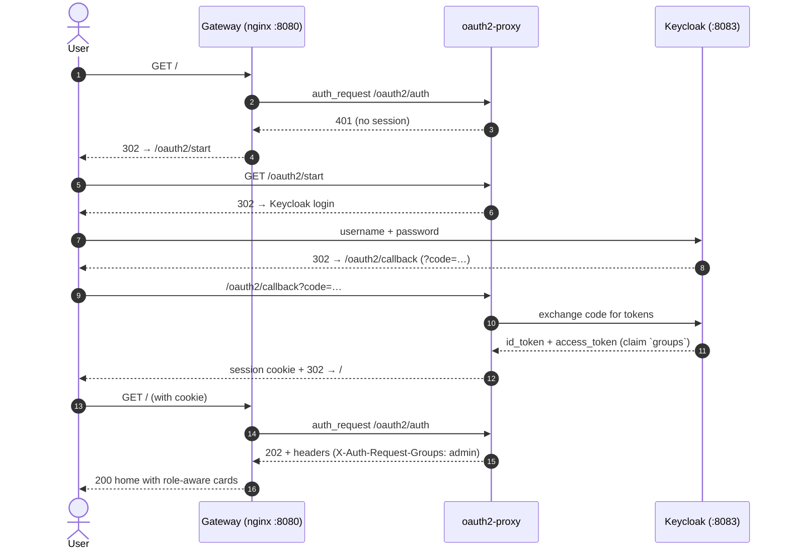
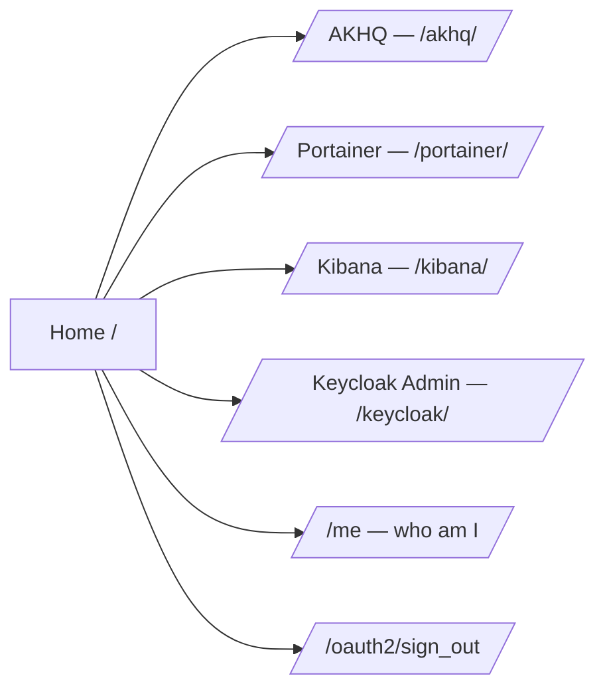
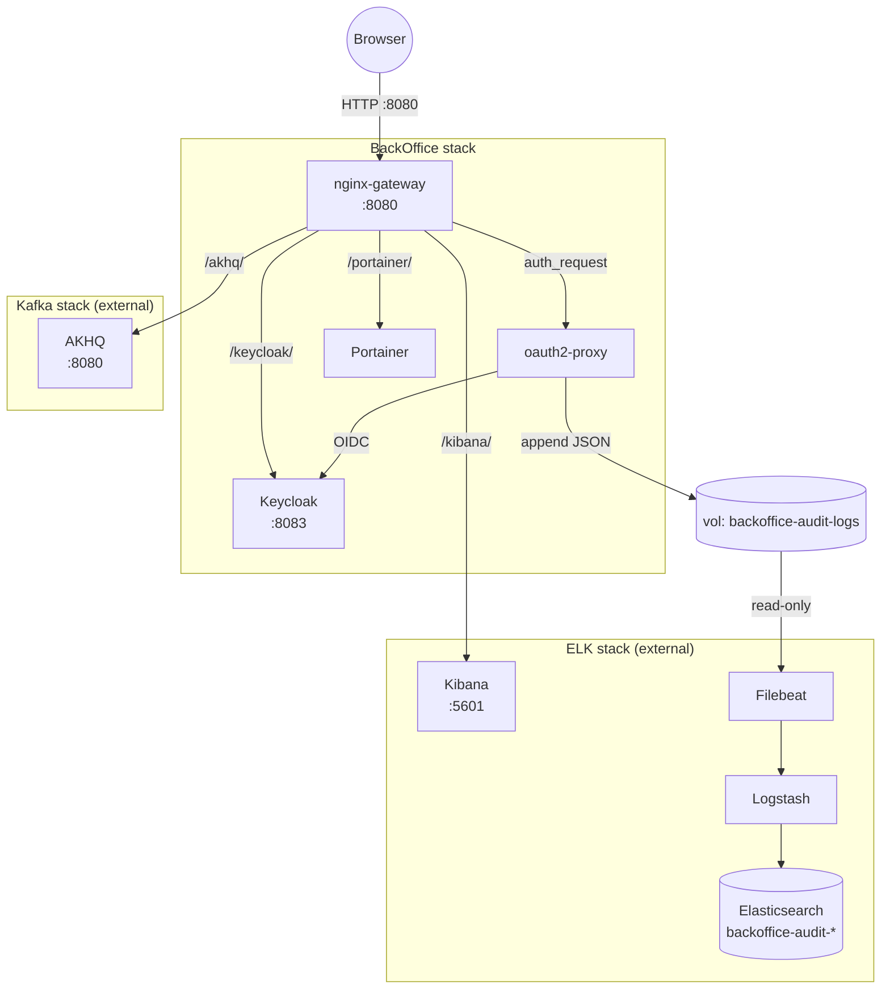
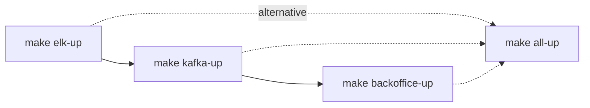
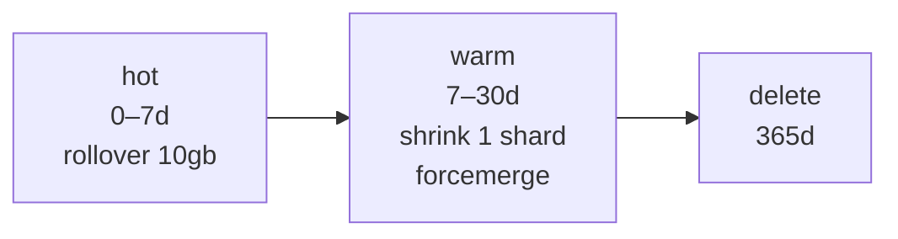
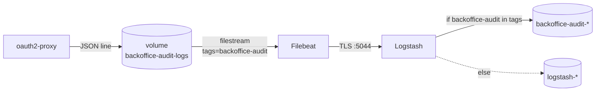

# BackOffice — User Guide

> Version 1.0.0 · MVP scope: C5 (Auth) + C6 (Audit) + C2 (Operate infra)
> 🇪🇸 Versión en español: [`user-guide.es.md`](./user-guide.es.md)

---

## Table of contents

- [Part 1 — End user guide](#part-1--end-user-guide)
  - [1.1 What is the BackOffice](#11-what-is-the-backoffice)
  - [1.2 Who can do what (roles)](#12-who-can-do-what-roles)
  - [1.3 First login](#13-first-login)
  - [1.4 The home page](#14-the-home-page)
  - [1.5 Tools you can use](#15-tools-you-can-use)
  - [1.6 Logout, session, password](#16-logout-session-password)
  - [1.7 Common errors](#17-common-errors)
- [Part 2 — Stack operator guide](#part-2--stack-operator-guide)
  - [2.1 Architecture overview](#21-architecture-overview)
  - [2.2 Install and start](#22-install-and-start)
  - [2.3 Stop, clean, reset](#23-stop-clean-reset)
  - [2.4 Manage users in Keycloak](#24-manage-users-in-keycloak)
  - [2.5 Audit log: where it lives, how to query](#25-audit-log-where-it-lives-how-to-query)
  - [2.6 Configuration files](#26-configuration-files)
  - [2.7 Operational runbooks](#27-operational-runbooks)
  - [2.8 Known limitations](#28-known-limitations)
  - [2.9 References](#29-references)

---

# Part 1 — End user guide

## 1.1 What is the BackOffice

A single web entry point at **`http://localhost:8080`** that lets the `lg-labs` team operate the whole infrastructure (Kafka, Docker, logs, identity) with **one login**. You do not need to remember separate URLs or passwords for each tool.

### Login flow (high level)



---

## 1.2 Who can do what (roles)

Your role decides which cards appear on the home page and which URLs respond `200` vs `403`.

| Role | AKHQ (Kafka) | Portainer (Docker) | Kibana (logs) | Keycloak Admin |
|---|:---:|:---:|:---:|:---:|
| **admin** | ✅ | ✅ | ✅ | ✅ |
| **operator** | ✅ | ✅ | ✅ | ❌ |
| **support** | ❌ | ❌ | ✅ | ❌ |
| **viewer** | ❌ | ❌ | ✅ | ❌ |

> If you try a forbidden URL directly (e.g. `viewer` opens `/akhq/`), the gateway returns **403 Acceso denegado**. This is by design.

---

## 1.3 First login

**Steps:**
1. Open `http://localhost:8080/`.
2. The browser redirects to Keycloak login.
3. Enter your username and password (ask your admin if you don't have one — see §2.4).
4. After success you land on the BackOffice home.

**Default seed users (lab only — DO NOT use in production):**

| Username | Password | Role |
|---|---|---|
| `lglabsadmin` | `lgpass` | admin |
| `lglabsoperator` | `lgpass` | operator |
| `lglabssupport` | `lgpass` | support |
| `lglabsviewer` | `lgpass` | viewer |

---

## 1.4 The home page

The home (`/`) shows one **card per tool you have access to**. The cards you see are computed in real time from your token's `groups` claim. If you don't see a card, you don't have access.

The home also shows your username and a **"Cerrar sesión"** (logout) button.



---

## 1.5 Tools you can use

### AKHQ — Kafka UI
Browse topics, partitions, consumer groups; produce/consume test messages; see broker health. **Path:** `/akhq/`.

### Portainer — Docker / containers
See running containers, view logs, restart/stop/start, attach a shell. **Path:** `/portainer/`. The first time, Portainer asks you to set its own admin password (lab default suggestion: `lgpass-portainer`).

### Kibana — Logs
Search and visualize logs ingested via Filebeat/Logstash. **Path:** `/kibana/`. Includes the saved search **"BackOffice Audit"** (data view `backoffice-audit-*`) for auditing every BackOffice request.

> ⚠️ **Kibana does not share SSO** (the Elasticsearch `basic` license does not include OIDC/SAML). The gateway authorizes by role, but Kibana then asks for its own login (`elastic` / password from `elk/.env`). See §2.8.

### Keycloak Admin Console
Manage users, roles, sessions, brute-force settings. **Path:** `/keycloak/`. **admin only.**

---

## 1.6 Logout, session, password

- **Logout:** click "Cerrar sesión" on the home (or go to `/oauth2/sign_out`). You will be sent back to the login page.
- **Session timeout:** by default sessions expire when you close the browser; refresh tokens may extend silent re-login (see oauth2-proxy `cookie_expire`).
- **Change my password:** go to `/keycloak/realms/lglabs/account/` (the Keycloak Account Console).

---

## 1.7 Common errors

| Symptom | Likely cause | Fix |
|---|---|---|
| `403 Acceso denegado` after login | Your role lacks permission for that path. | Use a card on the home, or ask admin for a role change. |
| `Account temporarily disabled` | 5+ failed login attempts triggered Keycloak brute-force protection (locked 15 min). | Wait 15 min, or admin unlocks via Keycloak Admin → users → Credentials → Reset. |
| `Account is not fully set up` | The seeded user is missing required fields (email). | Admin: edit the user in Keycloak and set the email; or re-import realm. |
| Browser keeps redirecting in a loop | Stale cookie. | Clear cookies for `localhost` or use a private window. |
| Kibana asks for username/password again | Expected — Kibana SSO not enabled (license). | Use `elastic` / password from `elk/.env`. |

---

# Part 2 — Stack operator guide

## 2.1 Architecture overview

### Components and traffic flow



### Container table

| Component | Container | Host port | Purpose |
|---|---|---|---|
| Keycloak | `lg-infra-backoffice-keycloak` | `8083` | IdP (OIDC) + user/role mgmt |
| oauth2-proxy | `lg-infra-backoffice-proxy` | (internal) | OIDC client + audit log writer |
| nginx gateway | `lg-infra-backoffice-gateway` | `8080` | Single entrypoint, role authz |
| Portainer | `lg-infra-backoffice-portainer` | (internal) | Docker UI |
| AKHQ | (in `kafka` stack) | (via `/akhq/`) | Kafka UI upstream |
| Kibana | (in `elk` stack) | (via `/kibana/`) | Logs UI upstream |
| Filebeat | (in `elk` stack) | — | Reads audit log file |
| Logstash | (in `elk` stack) | — | Routes audit to dedicated index |

---

## 2.2 Install and start

**Pre-requisites:** Docker + Docker Compose v2 + GNU make. The BackOffice depends on `elk` and `kafka` stacks running first (it joins their networks to reach `kibana:5601` and `akhq:8080`).

### Boot order



```bash
# from infrastructure/
make elk-up         # 1) Elasticsearch + Kibana + Filebeat + Logstash
make kafka-up       # 2) Kafka + AKHQ
make backoffice-up  # 3) Keycloak + oauth2-proxy + nginx + Portainer
# or all in one
make all-up
```

> First start of Keycloak takes ~60–90 s while it imports `realm-lglabs.json`. Wait for `lg-infra-backoffice-keycloak` healthcheck to be `healthy` before logging in.

### Quick health check

```bash
docker ps --filter name=lg-infra-backoffice
curl -s -o /dev/null -w "%{http_code}\n" http://localhost:8080/oauth2/ping   # expect 200
curl -s -o /dev/null -w "%{http_code}\n" http://localhost:8080/me            # expect 302
```

---

## 2.3 Stop, clean, reset

```bash
make backoffice-down      # stop, keep volumes (sessions persist)
make backoffice-clean     # stop + delete volumes (full reset)
make all-down             # stop everything
make all-clean            # full reset of everything
```

> `clean` removes the `backoffice-keycloak-data` volume → all custom users you created in Keycloak are lost. The 4 seed users come back from `keycloak/realm-lglabs.json` on next start.

---

## 2.4 Manage users in Keycloak

### Option A — UI (one-off changes)
1. Login to `http://localhost:8080/keycloak/` as `lglabsadmin` / `lgpass`.
2. Switch realm: top-left dropdown → **lglabs** (not `master`).
3. **Users** → **Add user**. Fill `username`, `email` (required), enable `Email verified`.
4. Tab **Credentials** → set password, disable **Temporary** if you want a permanent one.
5. Tab **Role mapping** → **Assign role** → filter realm roles (`admin`, `operator`, `support`, `viewer`) → pick one.

### Option B — Idempotent realm import (reproducible)
Edit `backoffice/keycloak/realm-lglabs.json`, then `make backoffice-clean && make backoffice-up`. The container runs with `--import-realm` and overwrites.

---

## 2.5 Audit log: where it lives, how to query

**Where:** every authenticated request goes to Elasticsearch index `backoffice-audit-YYYY.MM.DD`.

### Lifecycle (ILM `backoffice-audit-ilm`)



### Ingest pipeline



### Query from Kibana
1. Open `/kibana/` → **Discover**.
2. Select data view **BackOffice Audit** (`backoffice-audit-*`, time field `@timestamp`).
3. Or directly open the saved search **BackOffice Audit** (columns user, method, path, upstream, status, client_ip, duration; query `audit_type:request`).

### Query via curl

```bash
source elk/.env
# last 10 events
curl -sk -u "elastic:${ELASTIC_PASSWORD}" \
  "https://localhost:9200/backoffice-audit-*/_search?size=10&pretty&sort=@timestamp:desc"

# filter by user
curl -sk -u "elastic:${ELASTIC_PASSWORD}" \
  "https://localhost:9200/backoffice-audit-*/_search?q=user:lglabsadmin*&pretty"

# errors only (status 4xx/5xx)
curl -sk -u "elastic:${ELASTIC_PASSWORD}" \
  "https://localhost:9200/backoffice-audit-*/_search?q=status:%5B400%20TO%20599%5D&pretty"
```

> ⚠️ `path` is the auth-subrequest URI (`/oauth2/auth`), not the original client URI (`/portainer/...`). Limitation documented in `specs/design.md` §13.3 and `specs/backlog.md` B1.

---

## 2.6 Configuration files

| File | Purpose |
|---|---|
| `backoffice/.env` | Versions, ports, passwords (lab defaults). |
| `backoffice/docker-compose.yml` | Service definitions, volumes, networks, healthchecks. |
| `backoffice/keycloak/realm-lglabs.json` | Realm export: roles, users, OIDC client, audience mapper. |
| `backoffice/oauth2-proxy/oauth2-proxy.cfg` | OIDC settings, request/auth/standard logging formats, JWT bearer mode. |
| `backoffice/home/nginx.conf` | Gateway routing, role authorization, upstream proxy_pass. |
| `backoffice/home/html/index.html` | Static home with role-aware cards (JS reads `/me`). |
| `backoffice/kibana-init/setup-audit.sh` | Idempotent ILM + index template + data view + saved search. |
| `elk/filebeat.yml` | `backoffice-audit` filestream input (ndjson). |
| `elk/logstash.conf` | Conditional output by `[tags]`. |

---

## 2.7 Operational runbooks

### R1. Login fails after fresh start
Likely Keycloak still importing the realm.
1. `docker logs lg-infra-backoffice-keycloak --tail 50` → look for `Listening on: http://0.0.0.0:8080` and `Realm 'lglabs' imported`.
2. Wait until healthcheck = `healthy` (`docker ps`).
3. Retry.

### R2. Gateway crashes with `host not found in upstream "akhq"`
The kafka stack is down. Run `make kafka-up`, then `docker compose -f backoffice/docker-compose.yml up -d gateway` (or `docker restart lg-infra-backoffice-gateway`).

### R3. Filebeat shows `Error decoding JSON`
A line in `oauth2-proxy.log` is not valid JSON. Likely caused by editing `request_logging_format` and breaking quoting (oauth2-proxy already quotes `{{.RequestURI}}` — do not wrap it in `\"...\"`).

```bash
docker exec lg-infra-backoffice-proxy sh -c 'cat /dev/null > /var/log/proxy/oauth2-proxy.log'
docker restart lg-infra-backoffice-proxy
docker logs filebeat01 --since 30s | grep -c "Error decoding"   # must be 0
```

### R4. Audit index doesn't exist
Logstash may be running with stale config (it doesn't hot-reload by default).

```bash
docker restart logstash01
curl -sk -o /dev/null http://localhost:8080/me   # generate traffic
sleep 10
source elk/.env
curl -sk -u "elastic:${ELASTIC_PASSWORD}" "https://localhost:9200/_cat/indices/backoffice-audit-*?v"
```

### R5. Re-run Kibana provisioning
Idempotent — safe to re-run any time.

```bash
docker rm -f lg-infra-backoffice-kibana-init 2>/dev/null
docker compose -f backoffice/docker-compose.yml up kibana-init
```

### R6. Unlock a brute-force-locked user
1. Login Keycloak Admin (`/keycloak/`) as `lglabsadmin`.
2. Realm `lglabs` → **Users** → select user → tab **Credentials** → **Reset password** (this clears the lock).
3. Or wait 15 min for automatic unlock.

### R7. Rotate the OAuth2 client secret
1. Keycloak Admin → realm `lglabs` → **Clients** → `oauth2-proxy` → **Credentials** → **Regenerate Secret**. Copy.
2. Edit `backoffice/oauth2-proxy/oauth2-proxy.cfg`: replace `client_secret = "..."`.
3. `docker restart lg-infra-backoffice-proxy`.

### R8. ES out-of-memory after Kibana recreate
ES exit 137 happens on memory-tight machines. Increase `ES_MEM_LIMIT` in `elk/.env`, or restart manually: `docker start es01`.

### R9. Login redirects to a non-existent page (port stripped)
**Symptom:** clicking from `http://localhost:8080/` lands on `http://localhost/...` (no port → blank/not-found).
**Cause:** nginx returned a relative `Location` and the chain dropped the port; or `proxy_set_header Host` used `$host` instead of `$http_host` (loses port).
**Fix:** ensure `home/nginx.conf` uses `$http_host` for `/oauth2/` and `/oauth2/auth` blocks AND the `@redirect_to_login` returns an absolute URL: `return 302 $scheme://$http_host/oauth2/sign_in?rd=$scheme://$http_host$request_uri;`. Then `docker exec lg-infra-backoffice-gateway nginx -s reload`. Clear browser cookies for `localhost` afterwards.

---

## 2.8 Known limitations

| # | Limitation | Impact | Tracked in |
|---|---|---|---|
| L1 | Kibana login is **not** SSO (basic license) | Users see Kibana's own login after the gateway grants 200 | design §13/R4, backlog B2 |
| L2 | Audit `path` is `/oauth2/auth` not original URI | Cannot filter audits by which upstream a user accessed | design §13.3, backlog B1 |
| L3 | nginx resolves upstreams at startup → race condition | Gateway crashes if `kafka` or `elk` are down at boot | design §13.2, backlog B3 |
| L4 | Logstash does not hot-reload `logstash.conf` | Manual `docker restart logstash01` after config edits | runbook R4 |
| L5 | Lab passwords (`lgpass`) hardcoded in many places | Not safe outside lab | backlog B5 |
| L6 | Memory budget unverified end-to-end | Could OOM on small machines | backlog B4, TBD-Design-2 |

---

## 2.9 References

- `backoffice/CONSTITUTION.md` — 8 immutable principles guiding all decisions.
- `backoffice/specs/requirements.md` — what the BackOffice does (US + acceptance criteria), v0.3.0.
- `backoffice/specs/design.md` — how it is built (components, networks, gotchas), v0.2.0.
- `backoffice/specs/tasks.md` — implementation plan + status, v1.0.0.
- `backoffice/specs/smoke-tests.md` — reproducible tests per phase.
- `backoffice/specs/backlog.md` — post-MVP improvements and capabilities.
- `backoffice/README.md` — quick start (the TL;DR of this guide).
