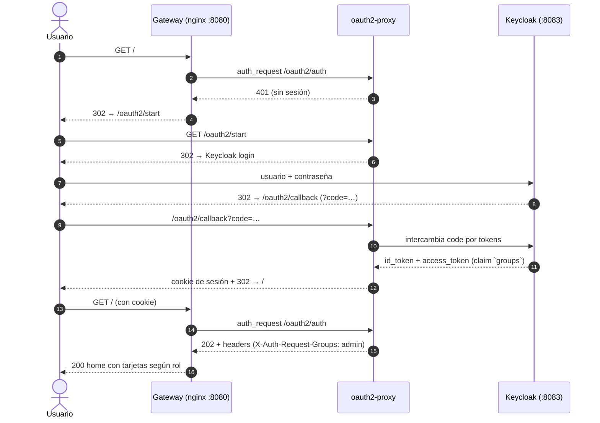
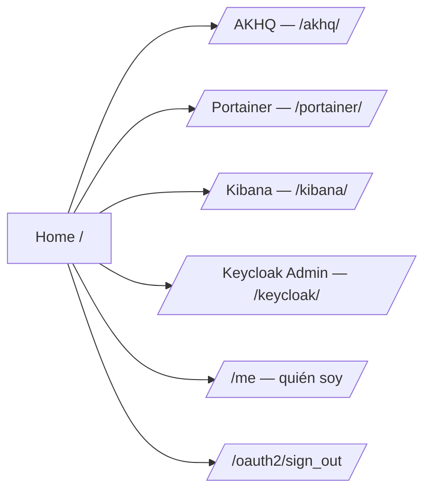
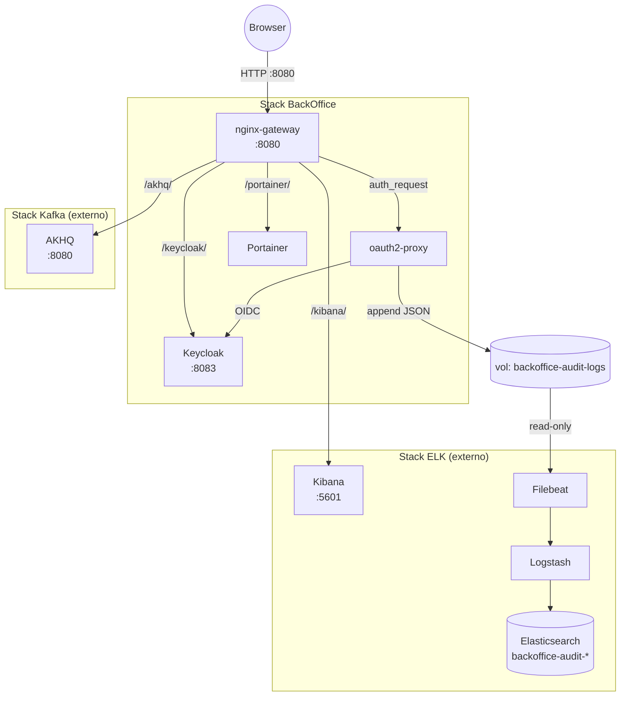
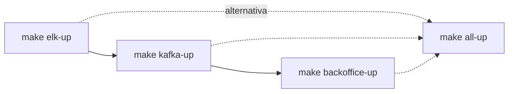
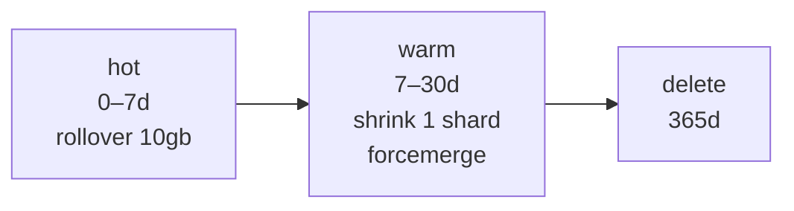
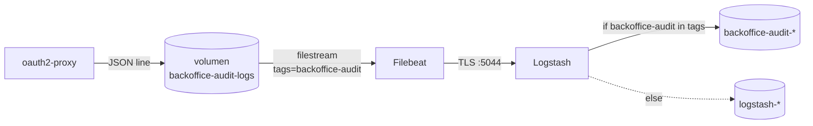

# BackOffice — Manual de Uso

> Versión 1.0.0 · MVP: C5 (Auth) + C6 (Audit) + C2 (Operar infra)
> 🇬🇧 English version: [`user-guide.en.md`](./user-guide.en.md)

---

## Índice

- [Parte 1 — Guía de usuario final](#parte-1--guía-de-usuario-final)
  - [1.1 ¿Qué es el BackOffice?](#11-qué-es-el-backoffice)
  - [1.2 ¿Quién puede hacer qué? (roles)](#12-quién-puede-hacer-qué-roles)
  - [1.3 Primer login](#13-primer-login)
  - [1.4 La página de inicio](#14-la-página-de-inicio)
  - [1.5 Herramientas disponibles](#15-herramientas-disponibles)
  - [1.6 Cerrar sesión, sesión, contraseña](#16-cerrar-sesión-sesión-contraseña)
  - [1.7 Errores comunes](#17-errores-comunes)
- [Parte 2 — Guía del operador del stack](#parte-2--guía-del-operador-del-stack)
  - [2.1 Vista de arquitectura](#21-vista-de-arquitectura)
  - [2.2 Instalación y arranque](#22-instalación-y-arranque)
  - [2.3 Detener, limpiar, resetear](#23-detener-limpiar-resetear)
  - [2.4 Gestionar usuarios en Keycloak](#24-gestionar-usuarios-en-keycloak)
  - [2.5 Auditoría: dónde está, cómo consultarla](#25-auditoría-dónde-está-cómo-consultarla)
  - [2.6 Archivos de configuración](#26-archivos-de-configuración)
  - [2.7 Runbooks operativos](#27-runbooks-operativos)
  - [2.8 Limitaciones conocidas](#28-limitaciones-conocidas)
  - [2.9 Referencias](#29-referencias)

---

# Parte 1 — Guía de usuario final

## 1.1 ¿Qué es el BackOffice?

Un único punto de entrada web en **`http://localhost:8080`** que permite al equipo de `lg-labs` operar toda la infraestructura (Kafka, Docker, logs, identidad) con **un solo login**. No hace falta recordar URLs ni contraseñas separadas por herramienta.

### Flujo de login (alto nivel)



---

## 1.2 ¿Quién puede hacer qué? (roles)

Tu rol decide qué tarjetas se ven en la home y qué URLs responden `200` vs `403`.

| Rol | AKHQ (Kafka) | Portainer (Docker) | Kibana (logs) | Keycloak Admin |
|---|:---:|:---:|:---:|:---:|
| **admin** | ✅ | ✅ | ✅ | ✅ |
| **operator** | ✅ | ✅ | ✅ | ❌ |
| **support** | ❌ | ❌ | ✅ | ❌ |
| **viewer** | ❌ | ❌ | ✅ | ❌ |

> Si intentas una URL prohibida directamente (ej. `viewer` abre `/akhq/`), el gateway responde **403 Acceso denegado**. Es a propósito.

---

## 1.3 Primer login

**Pasos:**
1. Abre `http://localhost:8080/`.
2. El navegador redirige al login de Keycloak.
3. Ingresa usuario y contraseña (pídeselos a tu admin si no los tienes — ver §2.4).
4. Tras el éxito aterrizas en la home del BackOffice.

**Usuarios seed por defecto (solo lab — NO usar en producción):**

| Usuario | Contraseña | Rol |
|---|---|---|
| `lglabsadmin` | `lgpass` | admin |
| `lglabsoperator` | `lgpass` | operator |
| `lglabssupport` | `lgpass` | support |
| `lglabsviewer` | `lgpass` | viewer |

---

## 1.4 La página de inicio

La home (`/`) muestra una **tarjeta por cada herramienta a la que tienes acceso**. Las tarjetas se calculan en tiempo real desde el claim `groups` de tu token. Si no ves una tarjeta, no tienes acceso.

La home también muestra tu usuario y un botón **"Cerrar sesión"**.



---

## 1.5 Herramientas disponibles

### AKHQ — UI de Kafka
Explora topics, particiones, consumer groups; produce/consume mensajes de prueba; ve la salud de los brokers. **Ruta:** `/akhq/`.

### Portainer — Docker / contenedores
Ve los contenedores corriendo, mira logs, reinicia/detén/arranca, abre una shell. **Ruta:** `/portainer/`. La primera vez Portainer pide configurar su propio admin (sugerencia para lab: `lgpass-portainer`).

### Kibana — Logs
Busca y visualiza logs ingeridos vía Filebeat/Logstash. **Ruta:** `/kibana/`. Incluye la saved search **"BackOffice Audit"** (data view `backoffice-audit-*`) para auditar cada request al BackOffice.

> ⚠️ **Kibana no comparte SSO** (la licencia `basic` de ES no incluye OIDC/SAML). El gateway autoriza por rol, pero Kibana luego pide su propio login (`elastic` / contraseña de `elk/.env`). Ver §2.8.

### Keycloak Admin Console
Gestiona usuarios, roles, sesiones, brute-force. **Ruta:** `/keycloak/`. **Solo admin.**

---

## 1.6 Cerrar sesión, sesión, contraseña

- **Cerrar sesión:** click "Cerrar sesión" en la home (o ir a `/oauth2/sign_out`). Te devuelve al login.
- **Caducidad de sesión:** por defecto la sesión expira al cerrar el navegador; los refresh tokens pueden extender el re-login silencioso (ver `cookie_expire` en oauth2-proxy).
- **Cambiar mi contraseña:** ir a `/keycloak/realms/lglabs/account/` (Account Console de Keycloak).

---

## 1.7 Errores comunes

| Síntoma | Causa probable | Solución |
|---|---|---|
| `403 Acceso denegado` tras login | Tu rol no tiene acceso a esa ruta. | Usa una tarjeta de la home, o pide cambio de rol. |
| `Account temporarily disabled` | 5+ intentos fallidos activaron la protección anti-fuerza-bruta (bloqueado 15 min). | Esperar 15 min, o admin desbloquea en Keycloak Admin → users → Credentials → Reset. |
| `Account is not fully set up` | El usuario seed no tiene email. | Admin: editar el usuario en Keycloak y poner email; o reimportar realm. |
| Bucle de redirects | Cookie obsoleta. | Borra cookies de `localhost` o usa ventana privada. |
| Kibana vuelve a pedir credenciales | Esperado — SSO de Kibana no habilitado (licencia). | Usa `elastic` / contraseña de `elk/.env`. |

---

# Parte 2 — Guía del operador del stack

## 2.1 Vista de arquitectura

### Componentes y flujo de tráfico



### Tabla de containers

| Componente | Container | Puerto host | Función |
|---|---|---|---|
| Keycloak | `lg-infra-backoffice-keycloak` | `8083` | IdP (OIDC) + gestión de users/roles |
| oauth2-proxy | `lg-infra-backoffice-proxy` | (interno) | Cliente OIDC + escribe audit log |
| nginx gateway | `lg-infra-backoffice-gateway` | `8080` | Punto único + autorización por rol |
| Portainer | `lg-infra-backoffice-portainer` | (interno) | UI de Docker |
| AKHQ | (en stack `kafka`) | (vía `/akhq/`) | UI de Kafka |
| Kibana | (en stack `elk`) | (vía `/kibana/`) | UI de logs |
| Filebeat | (en stack `elk`) | — | Lee el archivo de audit log |
| Logstash | (en stack `elk`) | — | Enruta audit a índice dedicado |

---

## 2.2 Instalación y arranque

**Pre-requisitos:** Docker + Docker Compose v2 + GNU make. El BackOffice depende de los stacks `elk` y `kafka` arriba (se une a sus networks para resolver `kibana:5601` y `akhq:8080`).

### Orden de arranque



```bash
# desde infrastructure/
make elk-up         # 1) Elasticsearch + Kibana + Filebeat + Logstash
make kafka-up       # 2) Kafka + AKHQ
make backoffice-up  # 3) Keycloak + oauth2-proxy + nginx + Portainer
# o todo de una
make all-up
```

> El primer arranque de Keycloak tarda ~60–90 s importando `realm-lglabs.json`. Espera a que el healthcheck de `lg-infra-backoffice-keycloak` esté `healthy` antes de loguearte.

### Verificación rápida

```bash
docker ps --filter name=lg-infra-backoffice
curl -s -o /dev/null -w "%{http_code}\n" http://localhost:8080/oauth2/ping   # esperado 200
curl -s -o /dev/null -w "%{http_code}\n" http://localhost:8080/me            # esperado 302
```

---

## 2.3 Detener, limpiar, resetear

```bash
make backoffice-down      # detiene, conserva volúmenes (sesiones persisten)
make backoffice-clean     # detiene + borra volúmenes (reset total)
make all-down             # detiene todo
make all-clean            # reset total de todo
```

> `clean` borra el volumen `backoffice-keycloak-data` → se pierden los usuarios que hayas creado en Keycloak. Los 4 usuarios seed vuelven al siguiente arranque desde `keycloak/realm-lglabs.json`.

---

## 2.4 Gestionar usuarios en Keycloak

### Opción A — UI (cambios puntuales)
1. Login en `http://localhost:8080/keycloak/` como `lglabsadmin` / `lgpass`.
2. Cambiar de realm: menú arriba a la izquierda → **lglabs** (no `master`).
3. **Users** → **Add user**. Rellenar `username`, `email` (obligatorio), activar `Email verified`.
4. Pestaña **Credentials** → poner contraseña, desactivar **Temporary** si quieres una permanente.
5. Pestaña **Role mapping** → **Assign role** → filtrar roles del realm (`admin`, `operator`, `support`, `viewer`) → elegir uno.

### Opción B — Import idempotente del realm (reproducible)
Editar `backoffice/keycloak/realm-lglabs.json`, luego `make backoffice-clean && make backoffice-up`. El contenedor arranca con `--import-realm` y sobrescribe.

---

## 2.5 Auditoría: dónde está, cómo consultarla

**Dónde:** cada request autenticada va al índice de Elasticsearch `backoffice-audit-YYYY.MM.DD`.

### Ciclo de vida (ILM `backoffice-audit-ilm`)



### Pipeline de ingesta



### Consultar desde Kibana
1. Abrir `/kibana/` → **Discover**.
2. Seleccionar la data view **BackOffice Audit** (`backoffice-audit-*`, time field `@timestamp`).
3. O directamente abrir la saved search **BackOffice Audit** (columnas user, method, path, upstream, status, client_ip, duration; query `audit_type:request`).

### Consultar vía curl

```bash
source elk/.env
# últimos 10 eventos
curl -sk -u "elastic:${ELASTIC_PASSWORD}" \
  "https://localhost:9200/backoffice-audit-*/_search?size=10&pretty&sort=@timestamp:desc"

# filtrar por usuario
curl -sk -u "elastic:${ELASTIC_PASSWORD}" \
  "https://localhost:9200/backoffice-audit-*/_search?q=user:lglabsadmin*&pretty"

# solo errores (status 4xx/5xx)
curl -sk -u "elastic:${ELASTIC_PASSWORD}" \
  "https://localhost:9200/backoffice-audit-*/_search?q=status:%5B400%20TO%20599%5D&pretty"
```

> ⚠️ `path` es la URI de la subrequest de auth (`/oauth2/auth`), no la URI original del cliente (`/portainer/...`). Limitación documentada en `specs/design.md` §13.3 y `specs/backlog.md` B1.

---

## 2.6 Archivos de configuración

| Archivo | Propósito |
|---|---|
| `backoffice/.env` | Versiones, puertos, contraseñas (defaults para lab). |
| `backoffice/docker-compose.yml` | Definiciones de servicios, volúmenes, networks, healthchecks. |
| `backoffice/keycloak/realm-lglabs.json` | Export del realm: roles, users, cliente OIDC, audience mapper. |
| `backoffice/oauth2-proxy/oauth2-proxy.cfg` | Settings OIDC, formatos de logging, JWT bearer mode. |
| `backoffice/home/nginx.conf` | Ruteo del gateway, autorización por rol, proxy a upstreams. |
| `backoffice/home/html/index.html` | Home estática con tarjetas según rol (JS lee `/me`). |
| `backoffice/kibana-init/setup-audit.sh` | Setup idempotente de ILM + template + data view + saved search. |
| `elk/filebeat.yml` | Input filestream `backoffice-audit` (ndjson). |
| `elk/logstash.conf` | Output condicional por `[tags]`. |

---

## 2.7 Runbooks operativos

### R1. El login falla tras arranque limpio
Probablemente Keycloak sigue importando el realm.
1. `docker logs lg-infra-backoffice-keycloak --tail 50` → buscar `Listening on: http://0.0.0.0:8080` y `Realm 'lglabs' imported`.
2. Esperar hasta que healthcheck = `healthy` (`docker ps`).
3. Reintentar.

### R2. Gateway crashea con `host not found in upstream "akhq"`
El stack de kafka está caído. Ejecutar `make kafka-up`, luego `docker compose -f backoffice/docker-compose.yml up -d gateway` (o `docker restart lg-infra-backoffice-gateway`).

### R3. Filebeat muestra `Error decoding JSON`
Una línea en `oauth2-proxy.log` no es JSON válida. Lo más probable: se editó `request_logging_format` y se rompió el quoting (oauth2-proxy ya quota `{{.RequestURI}}` — no envolverlo en `\"...\"`).

```bash
docker exec lg-infra-backoffice-proxy sh -c 'cat /dev/null > /var/log/proxy/oauth2-proxy.log'
docker restart lg-infra-backoffice-proxy
docker logs filebeat01 --since 30s | grep -c "Error decoding"   # debe ser 0
```

### R4. El índice de audit no existe
Puede que Logstash corra con config obsoleta (no hace hot-reload por defecto).

```bash
docker restart logstash01
curl -sk -o /dev/null http://localhost:8080/me   # generar tráfico
sleep 10
source elk/.env
curl -sk -u "elastic:${ELASTIC_PASSWORD}" "https://localhost:9200/_cat/indices/backoffice-audit-*?v"
```

### R5. Re-ejecutar el provisioning de Kibana
Idempotente — se puede re-ejecutar cuando quieras.

```bash
docker rm -f lg-infra-backoffice-kibana-init 2>/dev/null
docker compose -f backoffice/docker-compose.yml up kibana-init
```

### R6. Desbloquear un usuario bloqueado por brute force
1. Login en Keycloak Admin (`/keycloak/`) como `lglabsadmin`.
2. Realm `lglabs` → **Users** → seleccionar usuario → pestaña **Credentials** → **Reset password** (esto limpia el bloqueo).
3. O esperar 15 min para desbloqueo automático.

### R7. Rotar el client secret de OAuth2
1. Keycloak Admin → realm `lglabs` → **Clients** → `oauth2-proxy` → **Credentials** → **Regenerate Secret**. Copiar.
2. Editar `backoffice/oauth2-proxy/oauth2-proxy.cfg`: reemplazar `client_secret = "..."`.
3. `docker restart lg-infra-backoffice-proxy`.

### R8. ES OOM tras recrear Kibana
ES exit 137 pasa en máquinas con poca memoria. Subir `ES_MEM_LIMIT` en `elk/.env`, o reiniciar manualmente: `docker start es01`.

### R9. El login redirige a una página inexistente (puerto perdido)
**Síntoma:** desde `http://localhost:8080/` se aterriza en `http://localhost/...` (sin puerto → página en blanco/no encontrada).
**Causa:** nginx devolvió un `Location` relativo y la cadena perdió el puerto; o `proxy_set_header Host` usaba `$host` en vez de `$http_host` (pierde el puerto).
**Solución:** asegurar que `home/nginx.conf` use `$http_host` en los bloques `/oauth2/` y `/oauth2/auth`, Y que `@redirect_to_login` devuelva URL absoluta: `return 302 $scheme://$http_host/oauth2/sign_in?rd=$scheme://$http_host$request_uri;`. Luego `docker exec lg-infra-backoffice-gateway nginx -s reload`. Después borrar cookies de `localhost` en el navegador.

---

## 2.8 Limitaciones conocidas

| # | Limitación | Impacto | Tracking |
|---|---|---|---|
| L1 | Kibana login **no** es SSO (licencia basic) | Tras 200 del gateway, Kibana muestra su propio login | design §13/R4, backlog B2 |
| L2 | `path` en audit es `/oauth2/auth`, no la URI original | No se puede filtrar audits por upstream concreto | design §13.3, backlog B1 |
| L3 | nginx resuelve upstreams al startup → race condition | Gateway crashea si `kafka` o `elk` no están arriba al boot | design §13.2, backlog B3 |
| L4 | Logstash no hace hot-reload de `logstash.conf` | Reiniciar manualmente tras editar config | runbook R4 |
| L5 | Contraseñas de lab (`lgpass`) hardcodeadas en muchos sitios | No seguro fuera del lab | backlog B5 |
| L6 | Memory budget no verificado end-to-end | Puede OOM en máquinas pequeñas | backlog B4, TBD-Design-2 |

---

## 2.9 Referencias

- `backoffice/CONSTITUTION.md` — 8 principios inmutables.
- `backoffice/specs/requirements.md` — qué hace el BackOffice (US + criterios), v0.3.0.
- `backoffice/specs/design.md` — cómo está construido (componentes, networks, gotchas), v0.2.0.
- `backoffice/specs/tasks.md` — plan de implementación + estado, v1.0.0.
- `backoffice/specs/smoke-tests.md` — tests reproducibles por fase.
- `backoffice/specs/backlog.md` — mejoras post-MVP y capabilities pendientes.
- `backoffice/README.md` — quick start (TL;DR de esta guía).
